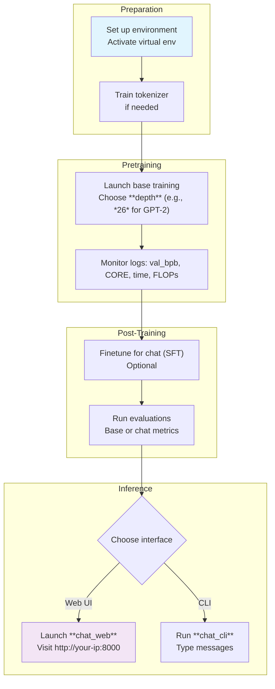

This section covers **nanochat**, a complete toolkit for training, evaluating, and chatting with small language models optimized for single GPU nodes. It's designed for researchers and hobbyists who want to experiment with large language model (LLM) workflows without complex setups. nanochat handles every stage—from tokenizer training and base model pretraining to chat finetuning, evaluation, and interactive inference—using a single complexity control called **depth** to automatically scale models to compute-optimal sizes (e.g., depth *12* for GPT-1-like capability, depth *26* for GPT-2-like). Track your progress on the time-to-GPT-2 leaderboard, where the goal is minimizing wall-clock training time to match or beat GPT-2 performance. For hands-on setup, see [Getting Started](getting-started.md). Dive into pretraining at [Training Base Models](training-base-models.md), chat model creation at [Training Chat Models](training-chat-models.md), evaluation at [Model Evaluation](model-evaluation.md), and interactive use at [Chatting with Models](chatting-with-models.md).

## Overview
nanochat simplifies LLM development into a streamlined pipeline visible through command-line controls, progress logs, and web/CLI interfaces. Launch training runs that automatically adjust hyperparameters like model width, learning rates, and training horizons based on your chosen **depth**. Monitor real-time metrics such as validation bits per byte (*val_bpb*), DCLM CORE score, training throughput (*tokens per second*), and model FLOPS utilization. After training, interact with models in a ChatGPT-style **web chat UI** or **CLI chat** for inference. All outputs save as checkpoints for resuming, evaluation, or deployment.

## Key Capabilities
- **Single-Dial Scaling**: Set **depth** to generate a full series of models from tiny (for quick tests) to GPT-2 scale, with everything else optimized automatically.
- **Full Pipeline**: Train tokenizers on custom data, pretrain base models, finetune for chat, run standardized evaluations, and chat interactively.
- **Hardware Flexibility**: Runs on single GPUs, multi-GPU nodes (e.g., 8xH100), CPU, or Apple Silicon, with automatic adjustments for memory limits.
- **Monitoring and Leaderboard**: Logs track training time, FLOPs, and CORE scores for "time-to-GPT-2" competition—beat GPT-2's *0.2565* CORE in under 3 hours on 8xH100.
- **Quick Experiments**: Short runs (e.g., 5 minutes) for iteration, full speedruns for leaderboard submissions.

## Time-to-GPT-2 Leaderboard
Compete to minimize wall-clock training time (in seconds, excluding evals) to exceed GPT-2's CORE score of *0.2565* on an 8xH100 node. Report your *total_training_time*, *val_bpb*, and CORE score from final logs.

| Rank | Time (hours) | val_bpb   | CORE    | Description                  | Date       |
|------|--------------|-----------|---------|------------------------------|------------|
| 0    | 168         | -         | *0.2565*| Original GPT-2              | 2019      |
| 1    | *3.04*      | *0.74833* | *0.2585*| d24 baseline, overtrained   | Jan 2026  |
| 2    | *2.91*      | *0.74504* | *0.2578*| d26 undertrained + fp8      | Feb 2026  |
| 3    | *2.76*      | *0.74645* | *0.2602*| d26 + doubled batch size    | Feb 2026  |

> [!NOTE]  
> Submit improvements via principled changes that scale across depths. See full details and submission guidelines in [Leaderboard and Optimization](leaderboard-and-optimization.md).

## End-to-End Workflow
Use this high-level flow to go from setup to chatting.

## Model Capabilities by Depth
**Depth** dials model size and capability. Even depths (e.g., *12*, *24*, *26*) recommended for clean scaling.

| Depth | Approx. Size    | Capability          | Typical Training Time (8xH100) | Use Case                  |
|-------|-----------------|---------------------|--------------------------------|---------------------------|
| *12*  | GPT-1 sized    | Quick experiments  | ~5-10 min                     | Iteration, research tests|
| *24*  | Near GPT-2     | Strong base        | ~3 hours                      | Leaderboard baseline     |
| *26*  | GPT-2 matching | Full speedrun      | ~2.8-3 hours                  | Chat, evaluation leader  |

| Setting              | Default     | Options                          | What It Controls |
|----------------------|-------------|----------------------------------|------------------|
| **depth**            | *12*       | Integer (e.g., *12*, *24*, *26*)| Model layers; auto-scales width, heads, LR, etc. for optimality |
| **device-batch-size**| *32*       | Powers of 2 (e.g., *16*, *8*)   | Per-GPU batch; lower to fit smaller GPUs, auto gradient accumulation |
| **target-param-data-ratio** | *10.5* | Float (e.g., *8.25*)            | Training tokens per param; tune for over/undertraining |
| **fp8**              | Off        | On/Off                          | Lower-precision training for speed (if hardware supports) |

> [!WARNING]  
> Reducing **device-batch-size** below *16* may require further tweaks to avoid memory errors; test incrementally.

## Summary
- nanochat provides an all-in-one pipeline for LLM training and chatting, controlled by a single **depth** dial for compute-optimal models.
- Achieve GPT-2 capability in ~3 hours on 8xH100; compete on the time-to-GPT-2 leaderboard with CORE > *0.2565*.
- Monitor key metrics like *val_bpb*, training time, and throughput during runs.
- Interact via **web chat UI** (ChatGPT-like) or **CLI chat** post-training.
- For setup, see [Getting Started](getting-started.md); pretraining details in [Training Base Models](training-base-models.md); full options in [Configuration Reference](configuration-reference.md); leaderboard tips in [Leaderboard and Optimization](leaderboard-and-optimization.md).