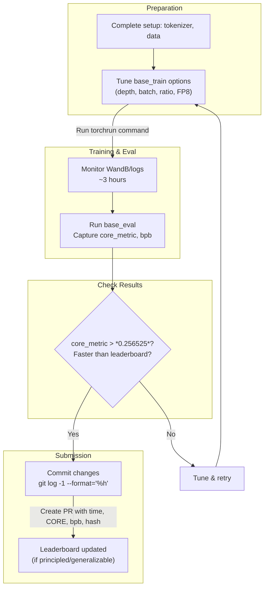

This section covers the Leaderboard and Optimization, designed for advanced users with access to an 8xH100 GPU node who want to compete in the "Time-to-GPT-2" challenge by minimizing wall-clock training time to exceed GPT-2's CORE score of *0.256525*. It explains how to execute optimized speedruns, monitor key metrics like **total_training_time** (in seconds, excluding evals/logging), validation **bpb**, and **core_metric**, and submit records via pull request. This extends workflows from [Training Base Models](training-base-models.md), [Model Evaluation](model-evaluation.md), and [Configuration Reference](configuration-reference.md), focusing on record-breaking efficiency rather than everyday training.

## Overview
The Leaderboard tracks the fastest real-world training times to produce a model outperforming GPT-2 on the CORE metric (an ensemble of 22 evaluations like ARC and MMLU). Users run the **speedrun.sh** script or tuned training commands, capture results from WandB summaries or logs, and submit improvements if they beat the current record while maintaining clean, generalizable changes. Success requires balancing model size (e.g., depth 24-26), batch sizes, precision (FP8 or BF16), and data ratios to hit the target in under 3 hours.

## Current Leaderboard
The table below lists top entries, ranked by **total_training_time** (converted to hours for readability). Each includes the **core_metric**, minimum validation **bpb**, key optimizations, and git commit hash for verification.

| Rank | Time (hours) | core_metric | val bpb   | Description                                                                 | Commit    |
|------|--------------|-------------|-----------|-----------------------------------------------------------------------------|-----------|
| 1    | 2.76        | *0.26024*  | *0.74645*| d26 model, doubled total batch size to 1M, FP8, param-data ratio 8.25      | *2c062aa* |
| 2    | 2.91        | *0.2578*   | *0.745036*| d26 model, FP8 training for faster steps, param-data ratio 8.5             | *a67eba3* |
| 3    | 3.04        | *0.25851*  | *0.74833* | d24 model, param-data ratio 12                                             | *348fbb3* |

> [!NOTE]  
> Times exclude evaluation and logging; focus on **total_training_time** from run summaries. New submissions must exceed *0.256525* CORE, beat the top time, and generalize across model sizes (e.g., d12 to d26).

## Running a Speedrun
The **speedrun.sh** script automates the full pipeline: dataset download, tokenizer training/eval, base model pretraining, evaluation, supervised finetuning (SFT), chat eval, and report generation. It targets a d26 model slightly undertrained to beat GPT-2 efficiently.

1. Ensure an 8xH100 GPU node and set **OMP_NUM_THREADS=1**.
2. Optionally set **WANDB_RUN** (e.g., *WANDB_RUN=d26*) after logging in via **wandb login** for tracking.
3. Run in a screen session for long jobs:  
   `screen -L -Logfile runs/speedrun.log -S speedrun bash runs/speedrun.sh`
4. Monitor progress: Dataset downloads (~370 shards for 10B tokens), tokenizer trains on 2B chars (vocab 32k), base training (~3 hours), SFT, evals.
5. At completion, check **report.md** (copied to current dir) for system info, metrics, and samples.

The script uses defaults like device batch size 16, FP8, and param-data ratio 8.25 for d26.

## Tuning for Optimization
For custom leaderboard attempts, use the **base_train** command directly after setup (tokenizer/data). Adjust via command-line options to fit hardware, avoid OOM, and optimize steps.

| Option                  | Default     | Accepted Values          | What It Controls |
|-------------------------|-------------|--------------------------|------------------|
| **--depth**            | *24*       | *24, 26* (powers of 2 preferred) | Model size (Transformer layers); larger needs tuning. |
| **--run**              | *dummy*    | Any string              | WandB run name for logging/tracking. |
| **--model-tag**        | *auto*     | Any string              | Checkpoint directory name on disk. |
| **--device-batch-size**| *32*       | *8, 16, 32* (powers of 2) | Tokens per GPU per forward pass; lower if OOM, auto-accumulates to target total batch. |
| **--target-param-data-ratio** | *10.5* | *8.25-12*              | Training horizon (tokens = params × ratio); lower for undertraining larger models. |
| **--fp8**              | *off*      | Flag (on/off)           | Enables FP8 for faster steps (H100+); falls back to BF16 otherwise (slightly stronger models). |
| **--total-batch-size** | *524288*   | *524288, 1048576*       | Global batch size; double for bigger models like d26. |
| **--core-metric-every**| *3000*     | *-1, 999999*            | Steps between CORE evals; high value runs once at end. |
| **--sample-every**     | *on*       | *-1*                    | Disables periodic text sampling to save time. |
| **--save-every**       | *on*       | *-1*                    | Disables periodic checkpoints. |

Example tuned command:  
`OMP_NUM_THREADS=1 torchrun --standalone --nproc_per_node=8 -m scripts.base_train -- --depth=26 --run="d26-feb2-fp8-ratio8.25" --model-tag="d26_feb2_fp8_ratio8.25" --device-batch-size=16 --target-param-data-ratio=8.25 --fp8 --sample-every=-1 --core-metric-every=999999`

After training, run **base_eval** for CORE/bpb/samples.

## Submitting to the Leaderboard
1. Verify **core_metric** > *0.256525*, note **total_training_time** (seconds from WandB summary), min val **bpb**, and flops.
2. Commit your optimizations (must generalize, avoid bloat/esoterica).
3. Get short hash: `git log -1 --format="%h"`.
4. Open a pull request with: time (hours), **core_metric**, **bpb**, command used, hash, **report.md** excerpts.
5. Await merge based on gains and quality.

> [!WARNING]  
> Only principled changes merge; test across depths (e.g., d24/d26) for miniseries compatibility.

## Summary
- Execute **speedrun.sh** for a full ~3-hour pipeline targeting GPT-2 capability on 8xH100.
- Tune **base_train** options like **--depth**, **--fp8**, batch sizes, and **--target-param-data-ratio** to minimize **total_training_time** while hitting **core_metric** > *0.256525*.
- Capture metrics from WandB summaries (**total_training_time**, **core_metric**, **bpb**) and submit via PR with git hash.
- Check [Training Base Models](training-base-models.md) for core training, [Model Evaluation](model-evaluation.md) for CORE details, [Configuration Reference](configuration-reference.md) for hardware options, and [Advanced Workflows](advanced-workflows.md) for extensions.