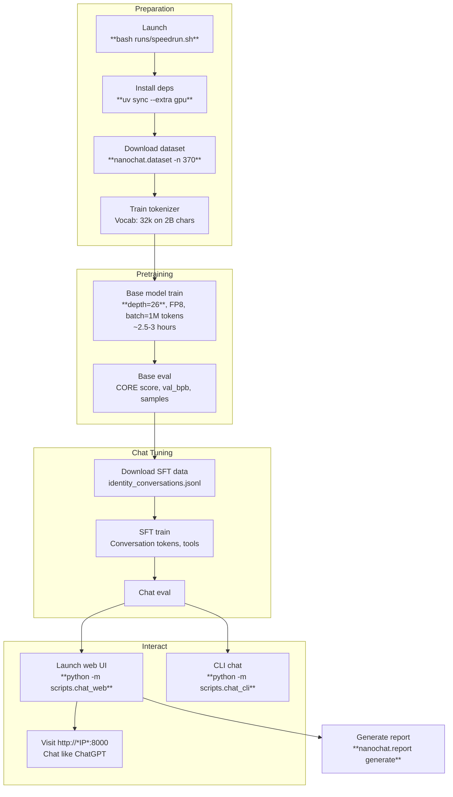

This section covers the Getting Started process, aimed at new users who want to quickly install dependencies, configure their environment, and execute the complete pipeline to train a GPT-2 capability model then chat with it interactively. It provides the fastest path from setup to hands-on experience with nanochat, bridging directly to core workflows like model training and chatting. For a high-level product introduction, see [Overview](overview.md). Detailed training options appear in [Training Base Models](training-base-models.md), while chatting interfaces are covered in [Chatting with Models](chatting-with-models.md). Hardware fallbacks and advanced configurations are in [Installation and Environment Setup](installation-and-environment-setup.md), [Reproducing GPT-2 Capability Model](reproducing-gpt-2-capability-model.md), and [Running on CPU or Single GPU](running-on-cpu-or-single-gpu.md).

## Overview
The Getting Started workflow automates installation, data preparation, tokenizer training, base model pretraining, supervised finetuning (SFT), evaluation, and chatting—all via a single script launch. On recommended hardware, the full pipeline to GPT-2 capability takes about 3 hours, producing a model you can chat with in a web UI resembling ChatGPT. Progress is logged to console output, optional remote logging, and a generated report summarizing metrics like validation bits per byte (*val_bpb*), DCLM CORE score, and samples.

## Hardware Requirements
Use the table below to verify your setup meets minimums for smooth operation. The pipeline auto-adjusts for smaller hardware but extends runtime proportionally.

| Setup | GPUs | VRAM per GPU | Est. Time to GPT-2 | Notes |
|-------|------|--------------|--------------------|-------|
| **Recommended** | 8x H100 | 80GB+ | ~3 hours | Full speed; uses **torchrun** for multi-GPU. |
| Alternative | 8x A100 | 40-80GB | ~4-5 hours | Slightly slower; same commands. |
| Single GPU Fallback | 1x (any modern) | 24GB+ | ~24 hours | Omits **torchrun**; auto-enables gradient accumulation. Reduce **device_batch_size** if out of memory. |
| CPU/MPS | None (CPU or Apple Silicon) | N/A | Days (toy model only) | Use dedicated script; weak results expected. |

> [!NOTE]  
> For GPUs under 80GB VRAM, start with **device_batch_size** of *16* or lower (e.g., *8*, *4*) to avoid memory errors. Monitor console for usage stats.

## Installation and Environment Setup
The pipeline handles dependency installation automatically via **uv**, a fast Python package manager. No manual steps are needed beyond launching the main script.

1. Access a GPU instance (e.g., from Lambda or your provider) with internet.
2. Open a terminal and navigate to the nanochat directory.
3. Run the all-in-one script:  
   `bash runs/speedrun.sh`  
   - Optional: Prefix with `screen -L -Logfile runs/speedrun.log -S speedrun` for detached execution (run lasts ~3 hours).  
   - Optional: Set `WANDB_RUN=*your-run-name*` (e.g., `WANDB_RUN=d26`) before launch for remote logging—login via `wandb login` first.

The script performs these automated actions:  
- Installs **uv** if missing.  
- Creates and activates a local virtual environment (**.venv**).  
- Installs GPU dependencies (adds CPU extras as fallback).  
- Resets and initializes a report directory in **~/.cache/nanochat**.  

Console output shows each phase: dataset download, tokenizer training, pretraining, finetuning, and evaluation. Artifacts save to **~/.cache/nanochat** by default.

| Environment Variable | Default | Purpose | Example |
|-----------------------|---------|---------|---------|
| **OMP_NUM_THREADS** | *1* | Limits CPU threads for stability. | `export OMP_NUM_THREADS=1` |
| **NANOCHAT_BASE_DIR** | **~/.cache/nanochat** | Root for datasets, models, reports. | `export NANOCHAT_BASE_DIR=/path/to/dir` |
| **WANDB_RUN** | *dummy* (no logging) | Enables remote experiment tracking. | *d26* (requires `wandb login`) |

## Reproducing GPT-2 Capability Model
This core workflow trains a depth-*26* model to match or exceed original GPT-2 performance (DCLM CORE ~0.257+), using ~10B tokens. It downloads ~350 dataset shards (~100GB compressed), trains a tokenizer, pretrains the base model, applies SFT for chat, evaluates, and generates a **report.md** summary.

Key controls during launch (edit **speedrun.sh** or pass as args):  
- **--depth**: Model layers (*26* for GPT-2).  
- **--target-param-data-ratio**: Balances params:data (*8.25* for slight undertrain).  
- **--device-batch-size**: Per-device batch (*16* default; lower for less VRAM).  
- **--fp8**: Enables low-precision for speed.  

Outputs include:  
- Trained models/checkpoints in **~/.cache/nanochat**.  
- Metrics: *val_bpb* (~0.745), CORE (~0.26).  
- Samples: Generated text in eval logs/report.  
- **report.md**: Full summary copied to current directory.

To chat post-training:  
1. Ensure virtual environment active: `source .venv/bin/activate`.  
2. Web UI: `python -m scripts.chat_web` → open printed URL (e.g., http://*public-IP*:8000). Type messages; model responds in real-time.  
3. CLI: `python -m scripts.chat_cli -p "*Why is the sky blue?*"` (or omit **-p** for interactive).

## Running on CPU or Single GPU
For non-H100 setups:  
- **Single GPU**: Omit `torchrun --nproc_per_node=8`; script auto-scales via gradient accumulation. Reduce **device_batch_size** to *1-8*.  
- **CPU/Apple Silicon (MPS)**: `bash runs/runcpu.sh`—trains tiny toy model in ~10-30 minutes for testing. Results are weak; scale up hardware for real use.

| Mode | Launch Command | Adjustments | Expected Outcome |
|------|----------------|-------------|------------------|
| Single GPU | `bash runs/speedrun.sh` (no **torchrun**) | **device_batch_size**=*8* or lower | ~8x slower; identical quality. |
| CPU/MPS | `bash runs/runcpu.sh` | None | Toy model; quick demo chats. |

> [!WARNING]  
> Low-VRAM runs may fail with memory errors—incrementally halve **device_batch_size** and retry.

## Summary
- Automate full pipeline with `bash runs/speedrun.sh` on 8xH100 (~3 hours to GPT-2 capability).
- Installs via **uv**; activates **.venv** automatically.
- Chat via web UI (**scripts.chat_web**) at http://*IP*:8000 or CLI (**scripts.chat_cli**).
- Tune via **--depth**, **device_batch_size**; monitor *val_bpb*/CORE in console/report.
- Fallbacks: Single GPU (gradient accum.), CPU (**runcpu.sh**).

See [Training Base Models](training-base-models.md) for custom pretraining, [Chatting with Models](chatting-with-models.md) for UI details, [Configuration Reference](configuration-reference.md) for hardware/precision options, and [Leaderboard and Optimization](leaderboard-and-optimization.md) for speedrun benchmarks.