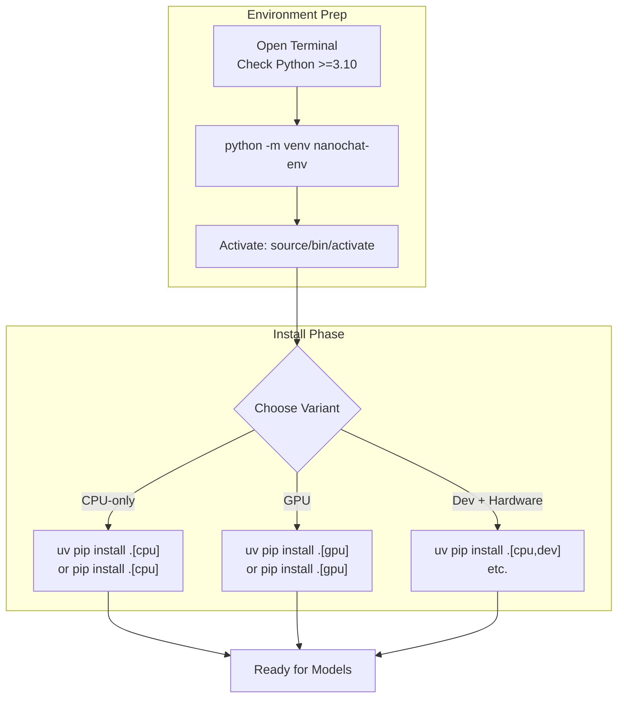

This section covers **Installation and Environment Setup**, the essential first step for users preparing to run nanochat on their local machine. It guides you through creating a virtual environment, installing dependencies via **uv** or **pip**, and selecting CPU or GPU variants to match your hardware. This setup ensures an isolated Python environment with all necessary libraries for training, evaluation, and chatting with models. After completion, proceed to [Reproducing GPT-2 Capability Model](reproducing-gpt-2-capability-model.md) for initial model runs or [Running on CPU or Single GPU](running-on-cpu-or-single-gpu.md) for hardware-specific execution. For advanced hardware tuning, see [Hardware and Precision Options](hardware-and-precision-options.md).

## Overview
The installation process sets up a self-contained Python environment (version 3.10 or higher) with core libraries for machine learning, web serving, and data handling. Key capabilities include:
- Choosing between **CPU** (for standard laptops/desktops) or **GPU** (for NVIDIA cards with CUDA 12.8 support) variants to optimize performance.
- Adding **dev** dependencies for testing and development.
- Automatic conflict resolution to prevent mixing incompatible CPU and GPU packages.

You'll interact via terminal commands, specifying *extras* like `[cpu]`, `[gpu]`, or `[dev]` during installation.

## Virtual Environment Setup
Before installing dependencies, create and activate a virtual environment to isolate nanochat from your system's Python setup.

1. Open your terminal.
2. Create the virtual environment: Run **python -m venv nanochat-env**.
3. Activate it:
   - On Linux/macOS: **source nanochat-env/bin/activate**
   - On Windows: **nanochat-env\Scripts\activate**

> [!NOTE]  
> Always activate the environment before running nanochat commands. Your prompt will show *(nanochat-env)* when active.

## Installing Dependencies
Install using **uv** (recommended for speed) or **pip**. Specify hardware via extras: `[cpu]` for CPU-only, `[gpu]` for GPU acceleration, or combine with `[dev]` for extras like testing tools.

### Using uv (Fastest Option)
1. Ensure **uv** is installed (via `curl -LsSf https://astral.sh/uv/install.sh | sh` if needed).
2. Navigate to the nanochat project directory.
3. Run **uv pip install .[cpu]** (or `[gpu]`, `[cpu,dev]`, etc.).

### Using pip
1. Ensure **pip** is up to date: **pip install --upgrade pip**.
2. Navigate to the nanochat project directory.
3. Run **pip install .[cpu]** (or `[gpu]`, `[cpu,dev]`, etc.).

| Dependency Group | Default | Options | What It Controls |
|------------------|---------|---------|------------------|
| **cpu** | None (install explicitly) | `[cpu]` | Installs CPU-optimized machine learning libraries (e.g., torch for non-GPU hardware). Use for laptops without NVIDIA GPUs. |
| **gpu** | None (install explicitly) | `[gpu]` | Installs GPU-accelerated libraries (e.g., torch with CUDA 12.8). Conflicts with `[cpu]`—cannot mix. Requires NVIDIA GPU. |
| **dev** | None (install explicitly) | `[dev]`, or combined like `[cpu,dev]` | Adds testing and development tools. Compatible with CPU or GPU. |

> [!WARNING]  
> Mixing `[cpu]` and `[gpu]` extras causes installation failure due to package conflicts. Choose one hardware variant.

## Verifying Installation
After installation:
1. Run **python -c "import torch; print(torch.__version__)"** to confirm core libraries.
2. For GPU: Run **python -c "import torch; print(torch.cuda.is_available())"**—expect *True* if set up correctly.

## Troubleshooting
Common issues appear as terminal error messages during installation or verification.

| Message | Severity | Meaning |
|---------|----------|---------|
| *No matching distribution found for torch* | Error | Hardware index mismatch. Retry with correct extra (`[cpu]` or `[gpu]`) or check internet/PyTorch indices. |
| *Conflict between cpu and gpu extras* | Error | Attempted to install both variants. Uninstall (`pip uninstall torch`), then reinstall one extra only. |
| *CUDA not available* (on GPU verification) | Warning | GPU libraries installed but no compatible NVIDIA hardware/driver. Fall back to `[cpu]` or update drivers. |
| *Python version too low* | Error | System Python <3.10. Upgrade Python or use a version manager like pyenv. |

## Summary
- Set up an isolated virtual environment with **python -m venv** and activate it for every session.
- Install via **uv pip install .[cpu]** (or `[gpu]`, `[dev]`) to match your hardware—**uv** is fastest.
- Verify with simple import checks; use tables above for extra selection.
- Proceed to [Reproducing GPT-2 Capability Model](reproducing-gpt-2-capability-model.md) for first model runs or [Hardware and Precision Options](hardware-and-precision-options.md) for tweaks. For chatting post-setup, see [Web Chat UI](web-chat-ui.md) and [CLI Chat](cli-chat.md).