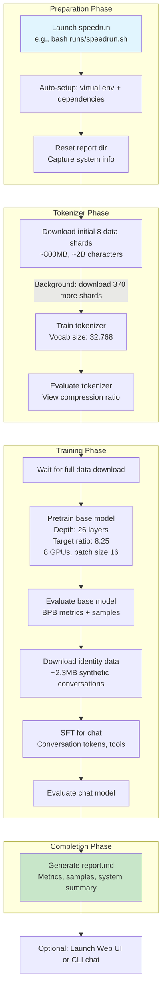

This section covers reproducing a GPT-2 capability model using the optimized speedrun workflow, designed for users with access to an 8-GPU high-performance node (such as 8xH100). It provides a complete end-to-end process—from data preparation and tokenizer training to base model pretraining, supervised finetuning (SFT), evaluation, and reporting—in approximately 3 hours. This fits into the getting started phase after 2.1. Installation and Environment Setup, serving as a benchmark to validate your environment before custom training in 3. Training Base Models or 5. Training Chat Models. For lighter hardware, see 2.3. Running on CPU or Single GPU. Progress can be monitored via external tools, with checkpoints and reports saved for inspection or resuming work. See 3.2. Monitoring and Checkpoints and 7.1. Web Chat UI for related features.

## Overview
The speedrun workflow automates the full pipeline to train a model matching GPT-2 performance, downloading necessary data (~800MB initially, more in background), training components sequentially, and generating a comprehensive **report.md** summarizing results. Users interact primarily via terminal commands, observing progress in logs, with optional integration to a monitoring dashboard. Key capabilities include:
- Automatic environment setup (virtual environment and dependencies).
- Parallel data downloading to minimize wait times.
- Training with optimized settings for the target hardware (e.g., FP8 precision, specific batch sizes).
- Generation of reusable artifacts like checkpoints, tokenizer files, and evaluation metrics.
- Final report compiling system info, metrics (e.g., bits per byte or BPB), and samples.

## Launch Options
Launch the speedrun from the project root directory. Use environment variables for customization.

| Setting | Default | Options | What It Controls |
|---------|---------|---------|------------------|
| **WANDB_RUN** | *dummy* (no external logging) | Any string (e.g., *speedrun*, *d26*) or *dummy* | Name of the run for dashboard logging; set before launch to enable real-time metric tracking, charts, and progress visualization in your WandB account. Requires prior login via **wandb login**. |
| **NANOCHAT_BASE_DIR** | *$HOME/.cache/nanochat* | Any writable path | Directory for all artifacts (data shards, checkpoints, tokenizer, reports). Created automatically if missing. |
| **OMP_NUM_THREADS** | *1* | Positive integer | Limits CPU threads for operations like data loading; set higher on multi-core systems for potential speedup. |

> [!NOTE]  
> For long runs (~3 hours), launch in a detachable session: **screen -L -Logfile runs/speedrun.log -S speedrun** followed by the speedrun command. View logs with **tail -f runs/speedrun.log**.

## Step-by-Step Workflow
Follow these steps to execute the speedrun. The process runs sequentially but downloads additional data in the background.

1. Open a terminal in the project root.
2. (Optional) Set **WANDB_RUN** (e.g., **export WANDB_RUN=speedrun**) and log in to WandB if using monitoring.
3. (Optional) Set **NANOCHAT_BASE_DIR** for custom artifact storage.
4. Launch: **bash runs/speedrun.sh**.
5. Monitor terminal output for phase progress (e.g., "Waiting for dataset download to complete...").
6. Upon completion (~3 hours), find **report.md** in the project root and **~/.cache/nanochat** (artifacts include data shards, tokenizer files, model checkpoints).

## Monitoring Progress
- **Terminal logs**: Real-time status updates for each phase, including download progress, training loss, and evaluation metrics.
- **WandB dashboard** (if enabled): Visit wandb.ai, select your project/run. View live charts for loss, BPB, samples, and hardware utilization.
- **Report directory**: Incremental markdown sections written to **$NANOCHAT_BASE_DIR/report/** during the run, finalized in **report.md**.

Checkpoints are saved automatically in **$NANOCHAT_BASE_DIR** subfolders (e.g., for base model and SFT), usable for resuming or evaluation. See 3.2. Monitoring and Checkpoints.

## Accessing Outputs and Next Steps
- **report.md**: Open in any markdown viewer for full summary, including BPB scores, generated samples, and tokenizer stats.
- **Model checkpoints**: Load into 7.1. Web Chat UI (**python -m scripts.chat_web**) or CLI chat (**python -m scripts.chat_cli**) for interaction.
- Data remains cached for reuse or custom workflows.

> [!WARNING]  
> Interrupting mid-run may leave partial checkpoints; resume manually via 3. Training Base Models configs matching speedrun settings.

## Summary
- Run **bash runs/speedrun.sh** for a 3-hour end-to-end GPT-2 reproduction on 8xH100, with auto-setup and optimized params.
- Customize via **WANDB_RUN** for dashboard monitoring and **NANOCHAT_BASE_DIR** for artifacts.
- Outputs: **report.md**, checkpoints, tokenizer—ready for chatting in 7.1. Web Chat UI or 7.2. CLI Chat.
- Builds foundation for advanced training in 3. Training Base Models, 5. Training Chat Models, or evaluation in 6. Model Evaluation.
- For setup prereqs, see 2.1. Installation and Environment Setup; for lighter runs, 2.3. Running on CPU or Single GPU.