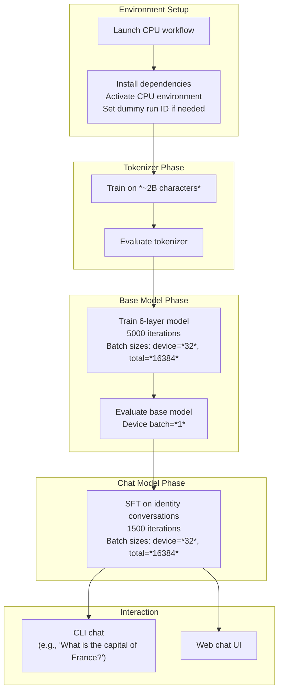

This section covers running the full workflow—tokenizer training, base model training, supervised finetuning (SFT), evaluation, and chatting—on CPU or single GPU hardware, such as MacBooks with MPS support. It's ideal for users with limited resources who want an educational demo to explore the product without high-end GPUs or significant costs. Expect slower performance and smaller-scale results compared to GPU-accelerated runs; training a small base model takes about 30 minutes on a high-end MacBook Pro. This builds directly on 2.1. Installation and Environment Setup and contrasts with the full-scale reproduction in 2.2. Reproducing GPT-2 Capability Model. For broader hardware tuning, see 9.1. Hardware and Precision Options; for production training, refer to 3. Training Base Models and 5. Training Chat Models.

## Overview
The CPU/single GPU workflow uses reduced model sizes, sequence lengths, and batch sizes to fit within memory constraints and avoid *out of memory (OOM)* errors. It demonstrates the end-to-end process: preparing a tokenizer on ~2 billion characters, training a compact 6-layer base model over 5000 iterations, evaluating it, applying SFT for 1500 iterations, and interacting via CLI or web chat. All steps activate a CPU-optimized environment automatically.

Key capabilities:
- Automatic environment setup with CPU extras.
- Tuned parameters for completion in under an hour on capable laptops.
- Direct progression to chatting, where the model can answer simple questions like capitals or colors.

## Environment Setup
Begin by executing the CPU demo workflow, which handles installation of CPU-optimized dependencies, creates a virtual environment, and activates it. It also ensures a run identifier is set (using *dummy* if none provided) for tracking.

> [!NOTE]  
> This step syncs *CPU extras*, enabling MPS on Apple silicon for faster performance than pure CPU.

## Tokenizer Training and Evaluation
Train a tokenizer on approximately *2 billion characters* (~34 seconds on MacBook Pro M3 Max), then evaluate it.

| Field | Required | Accepted Values | Description |
|-------|----------|-----------------|-------------|
| **max-chars** | Yes | Number (e.g., *2000000000*) | Limits training data to this many characters for quick demo. |

Cross-reference: Full details in 4. Tokenizer Training and Evaluation.

## Base Model Training and Evaluation
Train a small 6-layer base model tuned for ~30 minutes on MacBook Pro M3 Max, with window pattern *L*, max sequence length *512*, evaluations every *100* iterations, and sampling every *100* iterations. Follow with base evaluation using reduced batching.

| Setting | Default (CPU) | Options | What It Controls |
|---------|---------------|---------|------------------|
| **depth** | *6* | Positive integer (e.g., *4-12*) | Number of model layers; smaller fits low memory. |
| **head-dim** | *64* | Positive integer (e.g., *64*) | Attention head dimension; reduces compute. |
| **window-pattern** | *L* | *L*, *LQ*, etc. | Sequence handling pattern; *L* for linear efficiency. |
| **max-seq-len** | *512* | Positive integer (e.g., *512*) | Maximum tokens per sequence; lower avoids OOM. |
| **device-batch-size** | *32* (train), *1* (eval) | Positive integer | Samples per device; tune down for memory. |
| **total-batch-size** | *16384* | Positive integer (multiple of device batch) | Global batch across devices; scales with hardware. |
| **eval-every** | *100* | Positive integer or *-1* | Iterations between evaluations. |
| **eval-tokens** | *524288* | Positive integer | Tokens used in each evaluation. |
| **core-metric-every** | *-1* (disabled) | Positive integer or *-1* | Frequency of core metric computation. |
| **sample-every** | *100* | Positive integer | Frequency of model sampling outputs. |
| **num-iterations** | *5000* | Positive integer | Total training steps. |

> [!WARNING]  
> Increasing iterations or sizes may cause OOM; monitor memory usage.

Cross-reference: See 3. Training Base Models and 6.1. Base Model Evaluation.

## Supervised Finetuning (SFT)
Download *identity_conversations.jsonl* dataset automatically, then apply SFT (~10 minutes on MacBook Pro M3 Max) using similar batch sizes and max sequence *512*, with evaluations every *200* iterations.

Cross-reference: Full SFT details in 5.1. Supervised Finetuning (SFT).

## Chatting with the Model
After SFT:
- **CLI Chat**: Start a command-line interface; type prompts like *"What is the capital of France?"* or *"Hi, what color is the sky?"*. The model should respond with basics like *Paris* or *blue*.
- **Web Chat UI**: Launch a ChatGPT-style web interface for interactive conversations.

Cross-reference: 7.1. Web Chat UI and 7.2. CLI Chat.

## Batch Size Tuning Guidelines
Adjust these to prevent OOM errors on your hardware. Start conservative and increase gradually.

| Hardware | Recommended **device-batch-size** (Train) | Recommended **total-batch-size** | Expected Time (Base Train) | Notes |
|----------|-------------------------------------------|----------------------------------|----------------------------|-------|
| MacBook Pro M3 Max (MPS) | *32* | *16384* | ~30 minutes | Tuned baseline. |
| Standard Laptop CPU | *8-16* | *4096-8192* | 1-2 hours | Halve if OOM occurs. |
| Single Low-End GPU | *16* | *8192* | ~45 minutes | Monitor VRAM. |
| Very Low RAM (<16GB) | *4* | *2048* | 2+ hours | Disable evals if needed. |

## Troubleshooting
Common issues during low-hardware runs:

| Message | Severity | Meaning |
|---------|----------|---------|
| *Out of memory (OOM)* during training or eval | Error | Hardware can't fit the batch/sequence. Reduce **device-batch-size** by half and retry; see tuning table above. |
| *MPS not available* on Mac | Warning | Falling back to CPU; ensure Apple silicon and latest OS. Performance slower. |
| *No improvement in metrics* after many iterations | Info | Demo-scale limits; for better results, use GPU and increase **num-iterations** (see 3. Training Base Models). |
| *Dataset download failed* for SFT | Error | Network issue; manually download *identity_conversations.jsonl* to cache dir and retry. |

## Summary
- Run the CPU/single GPU workflow for a quick end-to-end demo fitting laptops, with auto-setup and tuned params to avoid OOM.
- Key phases: tokenizer (*2B chars*), base model (6 layers, *5000* iterations), SFT (*1500* iterations), and chat testing.
- Tune **device-batch-size** and **total-batch-size** per hardware; use the guidelines table.
- For scaling up, see 2.2. Reproducing GPT-2 Capability Model, 3. Training Base Models, and 9.1. Hardware and Precision Options.
- Interact via 7. Chatting with Models once complete.