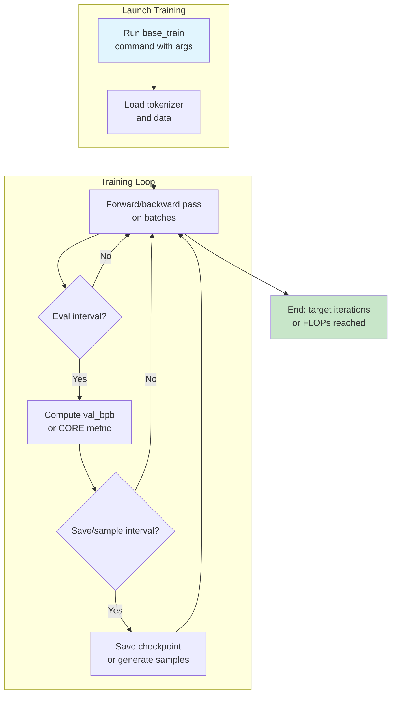

This section covers training base transformer models from scratch, a core step for creating compute-optimal LLMs scaled by a single **depth** dial. It's designed for users with access to GPU nodes (ideally 8x H100s for GPT-2 capability) who want to pretrain models efficiently before finetuning, evaluation, or chatting. Training here prepares raw models for [Training Chat Models](training-chat-models.md), [Model Evaluation](model-evaluation.md), and [Chatting with Models](chatting-with-models.md). For setup, see [Getting Started](getting-started.md); for hardware tweaks, see [Configuration Reference](configuration-reference.md).

## Overview
Training base models launches a pretraining loop that automatically scales model architecture, batch sizes, learning rates, and training duration for optimal performance. Users control complexity primarily via the **--depth** option (e.g., depth=26 approximates GPT-2 capability). The process loads data, runs optimization steps, evaluates validation loss periodically, computes capability metrics, and saves checkpoints. Progress appears in terminal output, Weights & Biases (if enabled), and generated samples. Expect wall-clock times from minutes (tiny models on CPU) to hours (full GPT-2 on multi-GPU).

## Configuring Model Size and Training Horizon
Set model scale and duration upfront via command-line options when launching training.

1. Activate your environment (e.g., `source .venv/bin/activate`).
2. From the project root, run the base training command:
   - Single device/CPU: `python -m scripts.base_train --depth=*N*`
   - Multi-GPU (recommended): `torchrun --nproc_per_node=*8* -m scripts.base_train --depth=*N*`
3. Adjust **--depth** (*default: 20*) to scale: smaller for experiments (e.g., *12* for ~5-min runs), *24-26* for GPT-2 capability.
4. Tune sequence length with **--max-seq-len** (*default: 2048*) and attention pattern via **--window-pattern** (*default: SSSL*; use *L* for full context).
5. Set training horizon with **--num-iterations** (explicit steps, *default: -1*), **--target-flops** (FLOPs target, *default: -1*), or **--target-param-data-ratio** (*default: 10.5*; Chinchilla-optimal is *20*).

> [!NOTE]  
> All hyperparameters (width, heads, rates) auto-scale with **--depth** for compute optimality—no manual tuning needed.

## Monitoring Training Progress and Checkpoints
Training outputs real-time stats to the terminal (master process only) and Weights & Biases (**--run**=*name*, *default: dummy* disables).

- Terminal shows: GPU details, vocab size, peak FLOPs, Flash Attention status, step progress, loss, throughput (tokens/sec), MFU (Model FLOPS Utilization).
- Evaluations trigger automatically:
  - Validation bits-per-byte (**val_bpb**) every **--eval-every** steps (*default: 250*).
  - CORE metric (capability score) every **--core-metric-every** steps (*default: 2000*).
  - Model samples every **--sample-every** steps (*default: 2000*).
- Checkpoints save every **--save-every** steps (*default: -1*, end-only) or on resume via **--resume-from-step**.
- Resume mid-run with **--resume-from-step**=*step_number*.

Launch with `torchrun` for distributed monitoring; view wandb at the printed URL.

## Configuration Options

| Setting | Default | Options | What It Controls |
|---------|---------|---------|------------------|
| **--run** | *dummy* | Any string (*dummy* disables) | Weights & Biases run name for logging metrics/plots |
| **--device-type** | *auto* | *cuda*, *cpu*, *mps* | Target device (autodetects if empty) |
| **--fp8** | off | on/off | Enables FP8 precision (H100+ only, faster) |
| **--fp8-recipe** | *tensorwise* | *rowwise*, *tensorwise* | FP8 scaling (tensorwise faster/recommended) |
| **--depth** | *20* | Positive integer | Transformer layers (main scaling dial) |
| **--aspect-ratio** | *64* | Positive integer | Scales model_dim = depth * aspect_ratio |
| **--head-dim** | *128* | Positive integer | Attention head dimension target |
| **--max-seq-len** | *2048* | Positive integer | Maximum context length |
| **--window-pattern** | *SSSL* | String (*L*=full, *S*=half) | Sliding window attention pattern |
| **--num-iterations** | *-1* | Positive integer or *-1* | Exact optimization steps |
| **--target-flops** | *-1.0* | Float or *-1* | FLOPs target to compute steps |
| **--target-param-data-ratio** | *10.5* | Float or *-1* | Data-to-params ratio for steps |
| **--device-batch-size** | *32* | Positive integer | Tokens per device (reduce on OOM) |
| **--total-batch-size** | *-1* | Positive integer or *-1* (auto) | Global tokens/batch |
| **--embedding-lr** / **--unembedding-lr** / **--matrix-lr** / **--scalar-lr** | *0.3* / *0.004* / *0.02* / *0.5* | Float | Learning rates by param group |
| **--weight-decay** | *0.2* | Float | Weight decay for optimizer |
| **--adam-beta1** / **--adam-beta2** | *0.8* / *0.95* | Float | Adam betas for embeddings |
| **--warmup-ratio** / **--warmdown-ratio** / **--final-lr-frac** | *0.0* / *0.5* / *0.0* | Float [0-1] | LR schedule fractions |
| **--resume-from-step** | *-1* | Integer or *-1* | Resume step |
| **--eval-every** / **--eval-tokens** | *250* / *40M* | Integer | Val bpb frequency/tokens |
| **--core-metric-every** / **--core-metric-max-per-task** | *2000* / *500* | Integer | CORE eval frequency/examples |
| **--sample-every** | *2000* | Integer or *-1* | Generation frequency |
| **--save-every** | *-1* | Integer or *-1* | Checkpoint frequency |
| **--model-tag** | *None* | String | Custom checkpoint dir tag |

## Key Metrics

| Metric | Interpretation | Target for Success |
|--------|----------------|-------------------|
| **val_bpb** | Validation bits-per-byte (lower better; vocab-invariant loss) | ~0.75 for GPT-2 capability |
| **CORE** | DCLM capability score (higher better; GPT-2 baseline *0.256*) | >*0.256* for GPT-2 match |
| **total_training_time** | Wall-clock hours to target | Leaderboard: <3 hours on 8xH100 |
| **FLOPs** | Total compute (e.g., 4e19 for GPT-2) | Matches scaling laws via **--depth** |
| **MFU** | Model FLOPS Utilization (% of peak) | >50% ideal; monitor for efficiency |
| **tok_per_sec** | Training throughput | Higher = faster training |

Plot in wandb vs. step/time/FLOPs.

## Troubleshooting

| Message | Severity | Meaning |
|---------|----------|---------|
| "GPU: *name* &#124; Peak FLOPS (BF16): *Xe*" | Info | Detected hardware/capacity; expect MFU relative to this. |
| "✓ Using Flash Attention 3 (Hopper GPU detected)..." | Info | Efficient attention enabled (H100+). |
| "WARNING: Flash Attention 3 not available... Training will be less efficient..." | Warning | Fallback to slower attention; upgrade GPU or expect low MFU. |
| "WARNING: SDPA has no support for sliding window attention (*pattern*)... GPU utilization will be terrible." | Warning | Use **--window-pattern L** for non-Hopper GPUs. |
| OOM/VRAM errors during batch | Error | Reduce **--device-batch-size** (e.g., to *16*, *8*) until fits. |

> [!WARNING]  
> Irreversible without checkpoints: Training overwrites progress unless **--save-every** set.

## Summary
- Train compute-optimal base models with one dial (**--depth**) for architecture, schedule, and horizon—ideal prep for [Training Chat Models](training-chat-models.md).
- Launch via `python -m scripts.base_train` (single) or `torchrun` (multi-GPU); monitor **val_bpb**, **CORE**, MFU in terminal/wandb.
- Key configs: **--device-batch-size** for VRAM, **--eval-every**/**--core-metric-every** for checks, **--save-every** for backups.
- For tiny/CPU runs, see [Getting Started](getting-started.md) > [Running on CPU or Single GPU](running-on-cpu-or-single-gpu.md); evaluate results in [Model Evaluation](model-evaluation.md) > [Base Model Evaluation](base-model-evaluation.md); chat via [Chatting with Models](chatting-with-models.md).