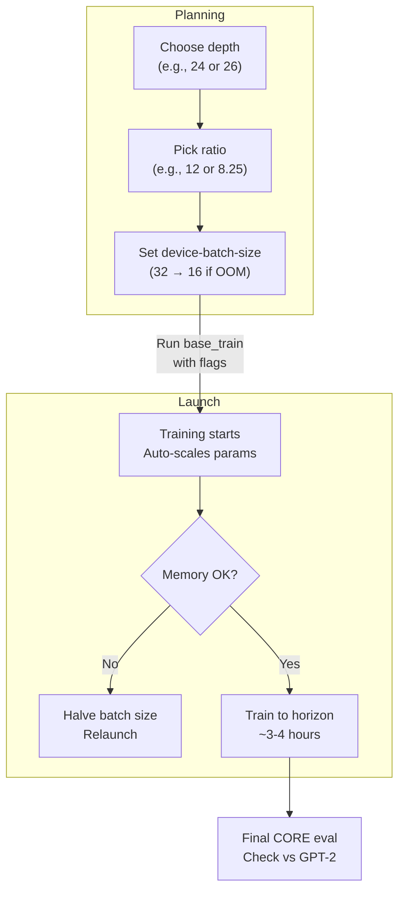

This section covers configuring model size and training horizon when training base models from scratch, designed for users running training jobs on GPU clusters (such as 8x H100 nodes) to achieve targeted capabilities like matching GPT-2 performance on the CORE metric. These settings control the Transformer's layer count, total training tokens relative to model parameters, and memory-efficient batch sizing, enabling efficient scaling within hardware limits. For the full base training workflow, see [Training Base Models](training-base-models.md). For progress tracking, see [Monitoring and Checkpoints](monitoring-and-checkpoints.md). All available options are detailed in [Configuration Reference](configuration-reference.md).

## Overview
Model size is set by the number of Transformer layers (**depth**), which automatically scales related dimensions like width, attention heads, and learning rates for balanced performance. The training horizon defines how many tokens to process, calculated as non-embedding parameters multiplied by **target-param-data-ratio**—a compute-optimal scaling law target (default around *10.5*). Batch size adjusts dynamically for memory constraints via **device-batch-size**, using gradient accumulation to maintain effective total batch size (ideally 524,288 tokens). Together, these let you tune for speedruns to GPT-2 equivalence (~0.256+ CORE score) in under 4 hours.

## Model Size (Depth)
The **depth** setting determines the number of Transformer layers, directly impacting model capacity (parameters). Higher values increase parameters for better capabilities but require more memory and compute.

- Even depths (e.g., *24*, *26*) are recommended for clean scaling of dimensions like head count.
- Parameters exclude embeddings; actual count shown in training logs.
- Auto-scales: width, heads, initial learning rate, and other hyperparameters proportionally.

| Depth | Approx. Parameters | Notes |
|-------|---------------------|-------|
| 18    | ~900M              | Smaller, faster training; baseline for testing. |
| 24    | ~1.4B              | Targets GPT-2 with higher ratio (e.g., *12*). |
| 26    | ~1.6B              | GPT-2 equivalent; use lower ratio (e.g., *8.25*) for undertraining efficiency. |

> [!NOTE]  
> Start with **depth 24** for most speedruns to GPT-2. Odd depths (e.g., *25*) may lead to suboptimal head dimensions.

## Training Horizon (Target Param-Data Ratio)
The **target-param-data-ratio** sets the tokens-to-parameters ratio, controlling total training steps (tokens = parameters × ratio ÷ (batch size × sequence length)). Lower values undertrain for faster runs; *10.5* is compute-optimal per scaling laws.

- Training ends automatically when the horizon is reached.
- Adjust lower for larger depths to hit exact capability targets like GPT-2 CORE score.

| Ratio | Training Steps (at ideal batch) | Use Case |
|-------|---------------------------------|----------```|
| 8.25  | ~16,000                        | Undertrain **depth 26** for GPT-2 equiv. |
| 10.5  | ~20,000                        | Compute-optimal default. |
| 12    | ~24,000                        | Overtrain **depth 24** for GPT-2 equiv. |

## Batch Size Adjustments
**device-batch-size** sets tokens per device before distribution across GPUs. The system targets a total batch size of 524,288 (32 × 2048 seq len × 8 GPUs) via automatic gradient accumulation.

1. Set to *32* (ideal) if memory allows.
2. Halve to *16*, *8*, etc., if out-of-memory occurs; accumulation steps double accordingly (e.g., 2 steps for *16*).
3. Keep powers of 2 for clean math.

| device-batch-size | Accumulation Steps | Total Batch Size | Memory Impact |
|-------------------|--------------------|------------------|---------------|
| 32                | 1                  | 524,288         | Highest throughput. |
| 16                | 2                  | 524,288         | For larger depths (e.g., 26). |
| 8                 | 4                  | 524,288         | Fallback for tight memory. |

> [!WARNING]  
> Too-high batch size causes out-of-memory crashes. Monitor GPU memory during initial steps and reduce if needed.

## Step-by-Step: Launching a Configured Training Run
Follow these steps to start training with custom size and horizon:

1. Prepare environment per [Getting Started](getting-started.md) > [Installation and Environment Setup](installation-and-environment-setup.md).
2. Train tokenizer if needed (see [Tokenizer Training and Evaluation](tokenizer-training-and-evaluation.md)).
3. Open terminal on your GPU node.
4. Run the base training command, adding your settings:
   - Include **--depth** (e.g., *24*).
   - Set **--target-param-data-ratio** (e.g., *12*).
   - Adjust **--device-batch-size** (e.g., *16*).
   - Disable extras for speedruns: **--sample-every=-1**, **--save-every=-1**, **--core-metric-every=999999** (final eval only).
5. Example for GPT-2 speedrun (**depth 26**):
   ```
   OMP_NUM_THREADS=1 torchrun --standalone --nproc_per_node=8 scripts.base_train --depth=26 --target-param-data-ratio=8.25 --device-batch-size=16 --run="my-run" --model-tag="my-model"
   ```
6. Monitor via WandB (logs **core_metric**, **total_training_time**); stop manually if needed.



## Troubleshooting
Common issues during configuration:

| Message | Severity | Meaning |
|---------|----------|---------|
| Out of memory during forward pass | Error | Batch too large for model depth/hardware. Reduce **device-batch-size** by half and relaunch. |
| CORE metric below 0.256 after run | Info | Undertrained; increase **target-param-data-ratio** or use smaller depth. Rerun with full eval (**--core-metric-max-per-task=-1**). |
| Uneven gradient accumulation steps | Warning | **device-batch-size** not power of 2; adjust to *16*, *32*, etc., for stability. |
| Training time exceeds 4 hours | Warning | High ratio or low batch; verify **total_training_time** in logs excludes evals. |

## Summary
- Use **depth** (*24*/*26*) to scale model size; auto-adjusts width/heads/LR.
- Set **target-param-data-ratio** (*8.25*-*12*) for training horizon targeting GPT-2 CORE (~0.256+).
- Tune **device-batch-size** (*16*-*32*) with auto-accumulation for memory efficiency.
- Ideal for 8x GPU speedruns; see [Leaderboard and Optimization](leaderboard-and-optimization.md) for top configs.
- Track via [Monitoring and Checkpoints](monitoring-and-checkpoints.md); full options in [Configuration Reference](configuration-reference.md) > [Hardware and Precision Options](hardware-and-precision-options.md).
- Next: Evaluate with [Model Evaluation](model-evaluation.md) > [Base Model Evaluation](base-model-evaluation.md).