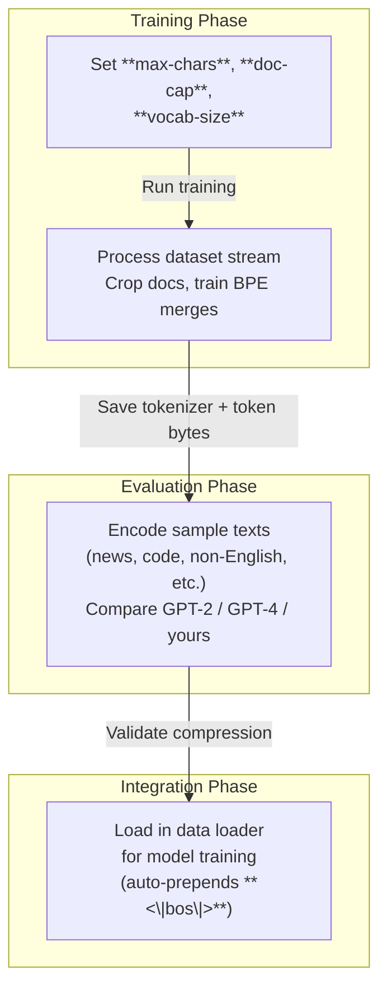

This section covers **Tokenizer Training and Evaluation**, tools for end users to create and assess custom Byte Pair Encoding (BPE) tokenizers optimized for your pretraining data. It's designed for users preparing base models or chat models, ensuring efficient text compression before model training. The trained tokenizer integrates directly into data loading during training workflows. For overall training setup, see [Training Base Models](training-base-models.md). For using tokenizers in chat or evaluation, see [Chatting with Models](chatting-with-models.md) and [Model Evaluation](model-evaluation.md). Configuration details appear in [Configuration Reference](configuration-reference.md).

## Overview
Tokenizer training builds a vocabulary from your pretraining dataset, learning merges that compress text into fewer, longer tokens for better model efficiency. Evaluation measures compression quality (e.g., tokens per byte) across English, non-English, code, math, and science texts, comparing against standard tokenizers like GPT-2 and GPT-4. Once trained and validated, the tokenizer is automatically used in data pipelines for model training, providing consistent tokenization with special tokens for document boundaries and chat formats.

## Training a Tokenizer
Training processes a stream of text documents from the pretraining dataset (train split), cropping each to a maximum length and stopping after a total character limit. It produces a BPE model in GPT-4 style, saves it for reuse, and computes byte lengths per token for evaluation metrics.

### Steps to Train
1. Prepare your pretraining data as described in [Getting Started](getting-started.md).
2. Run the training command with optional parameters to customize dataset usage and vocabulary.
3. Monitor console output for progress: it shows processed limits, training duration, and save location.
4. The system automatically saves the tokenizer and supporting files (including per-token byte counts) to the standard output directory.

> [!NOTE]  
> Training uses all available data shards until limits are hit, flattening batches into a continuous text stream.

### Training Configuration
| Setting | Default | Accepted Values | What It Controls |
|---------|---------|-----------------|------------------|
| **max-chars** | *2,000,000,000* | Positive integer | Total characters from dataset to use for training (higher values improve quality but increase time). |
| **doc-cap** | *10,000* | Positive integer | Maximum characters per individual document (trims longer docs to focus on diverse content). |
| **vocab-size** | *32,768* | Integer ≥ 512 (256 base + specials) | Final vocabulary size, including special tokens (larger = better compression but higher memory use). |

## Special Tokens
The tokenizer reserves fixed special tokens for structure, added automatically during training. These do not consume training merges.

| Token | Purpose |
|-------|---------|
| **<\|bos\|>** | Marks start of every document (required for training data). |
| **<\|user_start\|>** | Begins user messages (chat finetuning). |
| **<\|user_end\|>** | Ends user messages. |
| **<\|assistant_start\|>** | Begins assistant responses. |
| **<\|assistant_end\|>** | Ends assistant responses. |
| **<\|python_start\|>** | Starts Python tool invocation. |
| **<\|python_end\|>** | Ends Python tool invocation. |
| **<\|output_start\|>** | Starts tool output. |
| **<\|output_end\|>** | Ends tool output. |

## Evaluating a Tokenizer
Evaluation tests compression on held-out or sample texts without command-line options—it runs predefined benchmarks automatically. It encodes texts like news articles, Korean, code snippets, math documents, science passages, and validation data, reporting token counts and bits-per-byte ratios. Comparisons highlight improvements over GPT-2 (smaller vocab) and GPT-4 (similar style).

### Steps to Evaluate
1. Ensure a tokenizer exists from training (or use pretrained like GPT-2/GPT-4).
2. Run the evaluation command.
3. Review console output: tables of tokens used per text sample, ratios, and vocab sizes for each tokenizer.

> [!NOTE]  
> Lower tokens-per-character or bits-per-byte indicates better compression. Validation data uses your train/valid splits for realism.

## Tokenizer Workflow

## Troubleshooting
Common messages appear in the console during training or evaluation.

| Message | Severity | Meaning |
|---------|----------|---------|
| *max-chars: X,XXX,XXX,XXX doc-cap: X,XXX vocab-size: X,XXX,XXX* | Info | Confirms your configuration settings before starting. |
| *Training time: XX.XXs* | Info | Total duration completed; longer runs yield better tokenizers. If unexpectedly slow, check dataset access in [Getting Started](getting-started.md). |
| *Saved tokenizer to [path]* or *Saved token_bytes to [path]* | Info | Files ready for use; verify directory for manual inspection if needed. |
| *token_bytes_min: X token_bytes_max: X token_bytes_mean: X.X token_bytes_std: X.X* | Info | Statistics on non-special token lengths (in bytes); aim for mean ~3-4 for good compression. |
| *num_special_tokens: X* | Info | Confirms special token count (should be 9); mismatch indicates config issue. |

> [!WARNING]  
> If training stops early without "Training time" message, dataset may lack enough characters—increase shards via [Getting Started](getting-started.md).

## Summary
- Train custom BPE tokenizers on your data with configurable limits for optimal compression matching your domain.
- Evaluate via automated benchmarks comparing token efficiency to GPT-2/GPT-4 baselines.
- Special tokens enable seamless use in [Training Base Models](training-base-models.md), [Training Chat Models](training-chat-models.md), and [Chatting with Models](chatting-with-models.md).
- Follow the workflow: train → evaluate → integrate into data loaders for [Model Evaluation](model-evaluation.md).
- Adjust via [Configuration Reference](configuration-reference.md) for hardware tweaks during long runs.