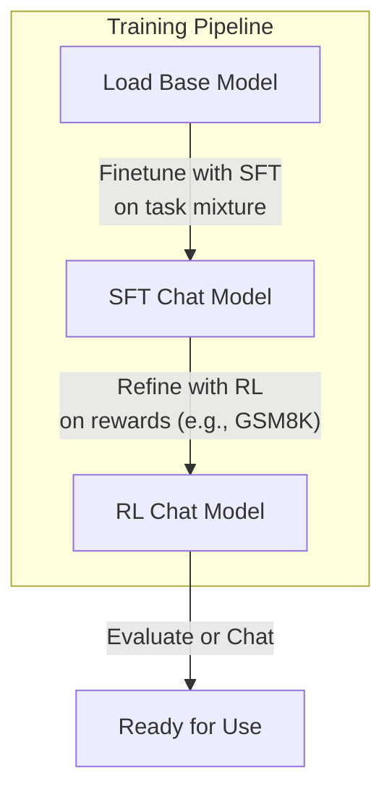

This section covers training chat models by finetuning pretrained base models using supervised finetuning (SFT) and reinforcement learning (RL). It is for users who want to adapt base models for conversational tasks, building directly on [Training Base Models](training-base-models.md) and preparing models for evaluation in [Model Evaluation](model-evaluation.md) or chatting in [Chatting with Models](chatting-with-models.md). SFT teaches the model to follow chat formats and handle tasks like math or multiple-choice questions, while RL improves performance on specific challenges like math reasoning. See [Configuration Reference](configuration-reference.md) for full option details and [Advanced Workflows](advanced-workflows.md) for custom integrations.

## Overview
Training chat models transforms a base model into a conversational agent capable of handling user-assistant exchanges. Key capabilities include:
- **Supervised Finetuning (SFT)**: Trains on mixtures of tasks like math problems (GSM8K), multiple-choice questions (MMLU), casual chat (SmolTalk), spelling tasks, or custom JSON conversations to learn chat behavior.
- **Reinforcement Learning (RL)**: Further refines SFT models on tasks like GSM8K using reward-based optimization to boost accuracy, such as pass@k metrics.
- Data handling: Uses predefined task mixtures or custom JSONL files with alternating *user* and *assistant* messages.
- Progress tracking: Automatic logging to tools like Weights & Biases, periodic evaluations (bits per byte loss, ChatCORE metrics, pass@k), and checkpoint saves.

The typical pipeline flows from a base model through SFT to RL:

## Supervised Finetuning (SFT)
SFT adapts base models to chat by training on conversation datasets. The process loads a base model checkpoint, inherits or overrides training settings, mixes tasks (e.g., 3 epochs MMLU, 4 epochs GSM8K), and optimizes over iterations or full epochs.

### Starting SFT
1. Ensure a base model checkpoint exists from [Training Base Models](training-base-models.md).
2. Launch the SFT process, specifying logging run name, device, model source, and batch details if overriding defaults.
3. Monitor console output for inherited settings (e.g., batch sizes, learning rates) and training stats like tokens per iteration, gradient accumulation steps, and model FLOPs.
4. Training runs until the specified iterations or full epoch, saving checkpoints periodically and evaluating validation loss or ChatCORE metrics at intervals.

During training, you'll see real-time metrics like loss, bits per byte (bpb), and task-specific scores. Checkpoints are tagged with the run name and step number for resuming.

### SFT Data Inputs
SFT uses a task mixture, including custom JSONL for user-provided conversations.

| Field | Required | Accepted Values | Description |
|-------|----------|-----------------|-------------|
| **messages** (JSONL line) | Yes | Array of objects: [{"role": "*user*", "content": "*text*"}, {"role": "*assistant*", "content": "*response*"}] | Alternating user-assistant messages; at least 2 per conversation; *content* must be string. Custom files loaded via task config. |
| MMLU epochs | No | Integer (default: *3*) | Repeats of multiple-choice data to teach selection. |
| GSM8K epochs | No | Integer (default: *4*) | Repeats of math/tool-use problems. |

> [!NOTE]  
> Custom JSONL files must exist; missing files trigger a helpful download hint for standard datasets.

### SFT Configuration Options
Override base model settings as needed.

| Setting | Default | Options | What It Controls |
|---------|---------|---------|------------------|
| **run** | *dummy* | String (e.g., *my-sft-run*) | Logging session name; *dummy* disables external logging. |
| **device-type** | Autodetect | *cuda*, *cpu*, *mps* | Hardware target. |
| **model-tag** / **model-step** | None | String / Integer | Base model checkpoint to load. |
| **num-iterations** | *-1* (full epoch) | Positive integer | Training steps. |
| **max-seq-len** | Inherited | Positive integer | Context length in tokens. |
| **device-batch-size** | Inherited (e.g., *32*) | Positive integer | Tokens per device per iteration. |
| **total-batch-size** | Inherited (e.g., *524288*) | Positive integer | Global tokens per update. |
| **embedding-lr** / **unembedding-lr** / **matrix-lr** | Inherited (e.g., *0.3* / *0.004* / *0.02*) | Float | Learning rates for parameter groups. |
| **eval-every** | *200* | Integer (*-1* disables) | Validation bpb evaluation interval. |
| **chatcore-every** | *200* | Integer (*-1* disables) | ChatCORE metric interval. |

## Reinforcement Learning (RL)
RL builds on SFT models, using reward signals (e.g., correct math solutions on GSM8K) to optimize generations. It samples multiple responses per prompt, computes rewards, and updates via policy gradients.

### Starting RL
1. Load an SFT model checkpoint.
2. Launch RL, setting epochs over the dataset (default: 1).
3. The process generates samples (e.g., 16 per example), scores them, evaluates pass@k periodically, and saves checkpoints.
4. Console shows step count, sampling details (temperature, top-k), and metrics like average reward.

### RL Data Inputs and Generation
Focused on GSM8K by default; samples completions after user prompts.

| Field | Required | Accepted Values | Description |
|-------|----------|-----------------|-------------|
| **max-new-tokens** | No | Integer (default: *256*) | Tokens generated per sample. |
| **temperature** | *1.0* | Float (>0) | Sampling randomness. |
| **top-k** | *50* | Integer (*0* disables) | Vocabulary restriction. |
| **num-samples** | *16* | Positive integer | Completions per prompt. |

### RL Configuration Options

| Setting | Default | Options | What It Controls |
|---------|---------|---------|------------------|
| **examples-per-step** | *16* | Positive integer | Prompts optimized per update. |
| **num-epochs** | *1* | Positive integer | Passes over dataset. |
| **eval-every** / **save-every** | *60* | Positive integer | Pass@k eval and checkpoint intervals. |
| **embedding-lr** / **unembedding-lr** / **matrix-lr** | *0.2* / *0.004* / *0.02* | Float | Learning rates. |

## Troubleshooting
Common console messages during training:

| Message | Severity | Meaning |
|---------|----------|---------|
| Inherited *setting*=*value* from pretrained checkpoint | Info | Using base model value since not overridden; training proceeds normally. |
| NOTE: *--setting*=*value* overrides pretrained value of *old-value* | Info | Your override applied; confirm it matches intent. |
| WARNING: Flash Attention 3 not available, using PyTorch SDPA fallback. Training will be less efficient. | Warning | Slower training due to missing optimization; install Flash Attention for better speed. |
| Warning: File *filepath* does not exist (with download hint) | Warning | Custom JSONL missing; download suggested file or provide your own to continue. |
| GPU: *name* \| Peak FLOPS (BF16): *flops* | Info | Hardware detected; use to estimate training time via model FLOPs. |

> [!WARNING]  
> Overriding batch sizes without sufficient hardware may cause out-of-memory errors; reduce **device-batch-size** or use more devices.

## Summary
- Use **SFT** to teach chat formats and tasks from mixtures like GSM8K/MMLU or custom JSONL conversations.
- Apply **RL** post-SFT for reward-driven improvements, e.g., on math accuracy.
- Configure via options for batching, learning rates, sampling, and evaluation intervals; inherit defaults from base models.
- Monitor via console logs, periodic evals, and checkpoints for resuming.
- For base model prep, see [Training Base Models](training-base-models.md); evaluate results in [Model Evaluation](model-evaluation.md); chat with outputs in [Chatting with Models](chatting-with-models.md) or [Web Chat UI](web-chat-ui.md). Full hardware options in [Configuration Reference](configuration-reference.md).