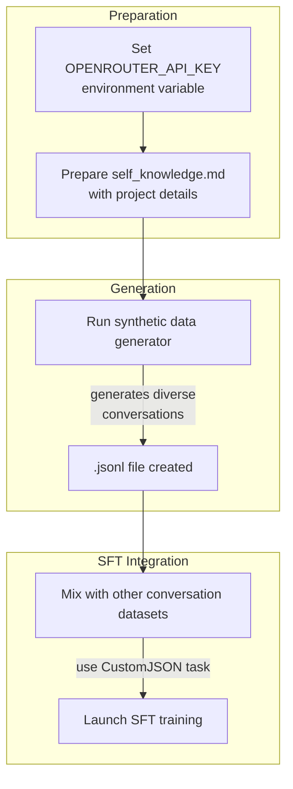

This section covers Supervised Finetuning (SFT), the process of adapting a trained base model into a chat model by training on conversation datasets, including synthetic data to instill the model's identity, capabilities, and limitations. It's designed for users who have completed base model training and want to create responsive chat assistants. SFT builds directly on [Training Base Models](training-base-models.md) and prepares models for evaluation in [Model Evaluation](model-evaluation.md) and chatting in [Chatting with Models](chatting-with-models.md). For tokenizer preparation, see [Tokenizer Training and Evaluation](tokenizer-training-and-evaluation.md); for advanced options, see [Configuration Reference](configuration-reference.md).

## Overview
Supervised Finetuning teaches the model to generate helpful, on-topic responses in multi-turn conversations by exposing it to high-quality dialogue examples. A key component is generating *synthetic data*—realistic conversations tailored to nanochat's unique traits—then mixing it with other datasets for training via the **CustomJSON** task. This ensures the model knows its architecture, training details, strengths, and limits without relying solely on generic data.

## Requirements
Before starting SFT:
- A trained base model checkpoint from [Training Base Models](training-base-models.md).
- An **OpenRouter API key** for synthetic data generation.
- A knowledge base file (**self_knowledge.md**) describing nanochat's identity, architecture, training process, capabilities, limitations, and history. If unavailable, use the project README or generate one by prompting a large language model with project details.

## Generating Synthetic Data
The synthetic data generator creates diverse, multi-turn conversations between users and nanochat, ensuring coverage of key topics while varying user styles and dialogue flows. Output is a **.jsonl** file of structured conversations, ready for mixing into SFT datasets.

### Step-by-Step Process
1. Set the **OPENROUTER_API_KEY** environment variable with your API key from OpenRouter.
2. Place or create your **self_knowledge.md** file in the expected location (project knowledge directory).
3. Run the synthetic data generator tool.
4. Wait for completion—the tool concurrently generates conversations and saves them to a **.jsonl** file.

> [!NOTE]  
> Generation uses controlled diversity for quality: random sampling across *topics* (e.g., identity, architecture), *user personas* (e.g., beginner, researcher), *conversation dynamics* (e.g., short Q&A, deep discussions), and *first messages* (e.g., greetings, curious openers). This produces balanced, realistic data without repetition.

The following table summarizes the main diversity dimensions:

| Dimension | Purpose | Examples |
|-----------|---------|----------|
| **Topics** | Cover nanochat's core knowledge areas | *identity* (who created nanochat), *architecture* (RoPE, Flash Attention), *training* (Muon optimizer, costs), *capabilities/limitations* (code writing, no internet), *comparisons/history* (vs. GPT-2) |
| **User Personas** | Simulate varied questioners | *curious beginner*, *ML researcher*, *skeptic*, *developer*, *student* |
| **Dynamics** | Vary conversation length and style | *short 2-turn Q&A*, *skeptical arc*, *learning journey*, *troubleshooting* |
| **First Messages** | Natural openers | *simple greetings* (Hi!, Hey), *with name* (Hi nanochat), *curious* (Who are you?) |

## Mixing Datasets and Running SFT
1. Combine the synthetic **.jsonl** with other conversation datasets (e.g., real user chats) into a single training file or directory.
2. Configure your training run to use the **CustomJSON** task.
3. Launch training, specifying the mixed dataset, base model checkpoint, and desired hyperparameters (e.g., learning rate, batch size—see [Configuration Reference](configuration-reference.md)).
4. Monitor progress for checkpoints, as described in [Monitoring and Checkpoints](monitoring-and-checkpoints.md).

The model learns to respond in a conversational format, infusing nanochat's identity throughout.

## Configuration Options
Synthetic data generation has minimal user settings, relying on built-in diversity controls. For training:

| Setting | Default | Options | What It Controls |
|---------|---------|---------|------------------|
| **OPENROUTER_API_KEY** | None (required) | Valid API key string | Access to OpenRouter for conversation generation |
| **Dataset Path** (for CustomJSON) | User-specified | Path to .jsonl or directory | Source of conversations for SFT |
| **Mix Ratio** (synthetic vs. others) | User-defined | Percentage (e.g., 20-50%) | Balance of identity-focused data |

## Summary
- Generate high-quality synthetic conversations using the dedicated tool to teach nanochat its identity, covering diverse **topics**, **personas**, **dynamics**, and **openers**.
- Mix synthetic data with other datasets and train via the **CustomJSON** task to create chat models from base models.
- Requires **OPENROUTER_API_KEY** and a **self_knowledge.md** file for accurate generation.
- For prerequisites, see [Training Base Models](training-base-models.md); for results, see [Chatting with Models](chatting-with-models.md) and [Model Evaluation](model-evaluation.md). Advanced hardware tweaks in [Hardware and Precision Options](hardware-and-precision-options.md).