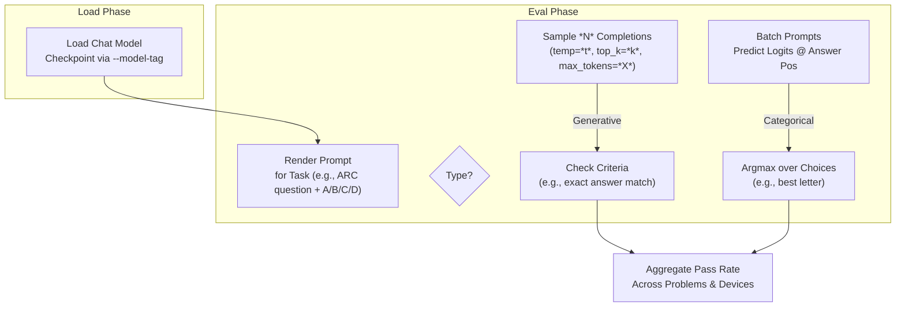

This section covers **Model Evaluation**, a key step for users who have trained base or chat models and want to benchmark their performance objectively. It's designed for end users assessing model quality after training, helping you compare capabilities against baselines like GPT-2 or leaderboard entries. Evaluations produce standardized scores such as the CORE metric for base models or pass@1 accuracy for chat tasks, which you can use to validate training results or submit to the [Leaderboard and Optimization](leaderboard-and-optimization.md). For preparing models to evaluate, see [Training Base Models](training-base-models.md) and [Training Chat Models](training-chat-models.md). After evaluation, try interacting via [Chatting with Models](chatting-with-models.md).

## Overview
Model evaluation lets you measure your base models on next-token prediction efficiency (bits per byte) and in-context learning (CORE benchmark), or your chat models on reasoning benchmarks like math, coding, and multiple-choice QA. Run evaluations from the command line using multi-GPU setups for speed or single-device for quick checks. Results appear directly in the console as accuracies, centered scores, and summaries, with options to limit scope for faster runs.

## Base Model Evaluation
Use base model evaluation to test raw language modeling capabilities without chat-specific finetuning. It supports three modes: **CORE** (in-context learning accuracy across 22 diverse tasks), **BPB** (bits per byte on validation data), and **sample** (text generation samples). Launch with a distributed command for GPUs or single-device for testing.

### Running Base Model Evaluation
1. Open your terminal in the project root.
2. For a trained nanochat model: Run `torchrun --nproc_per_node=*` (replace `*` with GPU count) `-m scripts.base_eval --model-tag *your-model-tag*` (e.g., `d24`).
3. For a HuggingFace model: Add `--hf-path *path*` (e.g., `openai-community/gpt2`).
4. Watch console output: It shows per-task progress like "Evaluating: *task* (0-shot, type: multiple_choice)... accuracy: *0.XXXX* | centered: *0.XXXX* | time: *X.XXs", followed by final CORE metric, BPB values, and samples.
5. Results aggregate automatically: CORE score (average centered accuracy), train/val BPB, and generated text snippets.

> [!NOTE]  
> First run downloads the eval bundle automatically if missing—expect a one-time ~GB download.

### CORE Evaluation Details
The **CORE** metric tests in-context learning by prompting the model with few-shot examples and measuring accuracy on held-out items across categories like multiple-choice QA, schema matching, and language modeling. Scores are *centered* using `(accuracy - 0.01 * random_baseline) / (1.0 - 0.01 * random_baseline)` to normalize against chance, then averaged.

| Task Category | Example Tasks | Few-Shot Levels | Scoring |
|---------------|---------------|-----------------|---------|
| Multiple Choice | PIQA, WinoGrande, ARC-Easy | 0-shot to 32-shot | Argmax over choices at continuation position |
| Schema | BoolQ, COPA, RTE | 0-shot to 32-shot | Prefix match on correct context |
| Language Modeling | LAMBADA, PIQA continuation | 0-shot to 32-shot | Next-token prediction after prompt |

Full results table prints per task with raw accuracy and centered value.

### BPB and Sample Modes
- **BPB**: Measures compression efficiency as bits per byte on train/validation splits (lower is better, e.g., GPT-2 ~1.4).
- **Sample**: Generates short text completions from prompts, printed to console for qualitative review.

## Chat Model Evaluation
Chat model evaluation benchmarks instruction-following and reasoning on standard tasks like coding (HumanEval), math (GSM8K), and knowledge (MMLU). Tasks are either *generative* (sample completions, check pass criteria) or *categorical* (predict best choice from logits). Results show pass rates like "*num_passed*/*total* (*XX.XX*%)".

### Running Chat Model Evaluation
1. Open your terminal.
2. List tasks with `-h` or run directly: `torchrun --nproc_per_node=* -m scripts.chat_eval -- -a *task-name*` (e.g., `ARC-Easy`).
3. Progress shows live: "Rank *X* \| *passed*/*total* (*XX.XX*%)".
4. Final summary prints aggregated accuracy across devices.

| Task | Type | Description | Input | Output | Metric |
|------|------|-------------|-------|--------|--------|
| **ARC-Easy** / **ARC-Challenge** | Categorical | Commonsense reasoning (easy/hard subsets) | Prompt with question + choices A-D | Predicted letter (A/B/C/D) | % correct choices |
| **GSM8K** | Generative | Grade-school math word problems | "Solve: *problem*" | Step-by-step solution + final numeric answer | % exact-match answers (multiple samples) |
| **MMLU** | Categorical | Multi-task knowledge (57 subjects) | Question + choices A-H | Predicted letter | % correct (test split) |
| **HumanEval** | Generative | Python coding problems | "Write function: *docstring*" | Executable code | % pass@1 (functional tests) |
| **SpellingBee** | Generative | Spell pangrams from letters | "Letters: *set*, make words" | List of valid words | % valid spellings (size=256) |

### Generative vs. Categorical Workflows

## Configuration Options
Customize evaluations with these command-line flags (shared where applicable).

### Base Model Flags
| Setting | Default | Accepted Values | What It Controls |
|---------|---------|-----------------|------------------|
| **--eval** | *core,bpb,sample* | Comma-separated: *core*, *bpb*, *sample* | Modes to run (mix/match) |
| **--hf-path** | None | HuggingFace path (e.g., *openai-community/gpt2*) | Load external model instead of local |
| **--model-tag** | None | Tag (e.g., *d24*) | Local checkpoint directory |
| **--step** | Last | Integer step | Specific checkpoint version |
| **--max-per-task** | All (-1) | Positive integer | Limit examples per CORE task (for speed) |
| **--device-batch-size** | 32 | Positive integer | Batch size per device (BPB) |
| **--split-tokens** | 20M | Positive integer | Tokens per train/val split (BPB) |
| **--device-type** | Autodetect | *cuda*, *cpu*, *mps* | Target hardware |

### Chat Model Flags
| Setting | Default | Accepted Values | What It Controls |
|---------|---------|-----------------|------------------|
| **-a** / **--task** | None (required) | *ARC-Easy*, *ARC-Challenge*, *GSM8K*, *MMLU*, *HumanEval*, *SpellingBee* | Benchmark to run |
| **--num-samples** | 1 | Positive integer | Completions per generative problem |
| **--max-new-tokens** | 512 | Positive integer | Generation length limit |
| **--temperature** | 0.0 | Float [0.0-1.0+] | Sampling randomness |
| **--top_k** | 50 | Positive integer | Top-K sampling |
| **--batch-size** | 1 | Positive integer | Categorical batch size |
| **--max-problems** | All | Positive integer | Limit problems (for speed) |

## Troubleshooting
Common issues and console messages:

| Message | Severity | Meaning |
|---------|----------|---------|
| "Eval bundle not found—downloading..." | Info | Automatic download starting; ensure internet access. |
| "accuracy: *X.XXXX* \| centered: *X.XXXX*" | Info | Per-task result; lower centered scores indicate poor in-context learning—check training [Monitoring and Checkpoints](monitoring-and-checkpoints.md). |
| "Final: *X*/*Y* (*Z.ZZ*%)" | Info | Aggregated score; compare to baselines (e.g., GPT-2 CORE ~0.2). |
| "Invalid eval mode" | Error | Unknown --eval value; use only *core*, *bpb*, *sample*. |
| "Rank *X* \| *passed*/*total*" stuck | Warning | Slow progress; reduce --max-per-task or use more GPUs via torchrun. |

## Summary
- Evaluate **base models** with **CORE** (centered ICL accuracy), **BPB** (efficiency), and samples via `scripts.base_eval`.
- Test **chat models** on tasks like **ARC**, **GSM8K**, **MMLU** via `scripts.chat_eval -a *task*`, with generative/categorical handling.
- Use flags like **--max-per-task** for quick runs; results print to console for easy comparison.
- Relates to [Training Base Models](training-base-models.md) (checkpoints), [Training Chat Models](training-chat-models.md) (SFT), and [Leaderboard and Optimization](leaderboard-and-optimization.md) (submissions). For interaction post-eval, see [Chatting with Models](chatting-with-models.md).