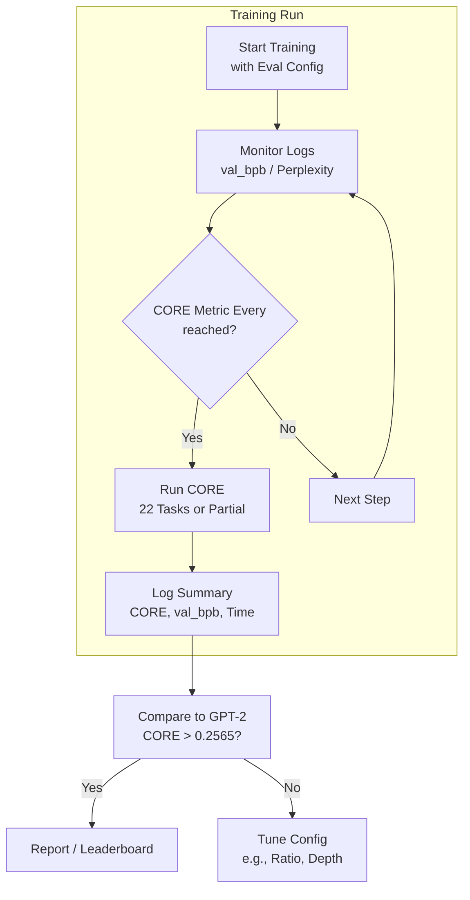

This section covers **Base Model Evaluation**, the process of assessing pretrained language models using key metrics like the CORE score, validation bits per byte (*val_bpb*), and perplexity. It's designed for users training base models who want to benchmark performance against the GPT-2 baseline (target CORE > *0.2565*) and monitor training quality. This fits into the broader model development workflow after [Training Base Models](training-base-models.md) and before [Training Chat Models](training-chat-models.md) or [Chatting with Models](chatting-with-models.md). For full evaluation pipelines, see [Model Evaluation](model-evaluation.md); for leaderboard comparisons, see [Leaderboard and Optimization](leaderboard-and-optimization.md).

## Overview
Base model evaluation measures general capabilities through the **CORE** composite score (a mean of centered accuracies across 22 tasks in world knowledge, language understanding, commonsense reasoning, symbolic problem solving, and reading comprehension) and efficiency metrics like **val_bpb** (bits needed to encode validation data, lower is better) and **perplexity** (exponential of *val_bpb* times log base 2, lower is better). Users trigger evaluations during training to track progress toward GPT-2 parity, with outputs visible in logs and summaries.

## Key Metrics
These metrics appear in training logs, summaries, and monitoring tools after evaluation runs.

| Metric     | Description                                                                 | GPT-2 Target / Example          |
|------------|-----------------------------------------------------------------------------|---------------------------------|
| **CORE**  | Single score from 22 few-shot tasks; accounts for random baselines via centering. Higher is better. | > *0.2565*                     |
| **val_bpb** | Validation loss in bits per byte; indicates data compression efficiency. Lower is better. | ~ *0.748* (e.g., *0.74833*)   |
| **Perplexity** | Prediction uncertainty measure; derived from *val_bpb*. Lower is better.   | Derived (e.g., ~ *1.68*)       |

> [!NOTE]  
> CORE can be noisy due to task variance; cross-check with *val_bpb* for stable progress signals.

## Configuring Evaluation
Control evaluation frequency and scope via training settings to balance compute cost and monitoring needs. Full CORE runs all 22 tasks; partial limits tasks for speed.

| Setting                  | Default     | Options                          | What It Controls |
|--------------------------|-------------|----------------------------------|------------------|
| **CORE Metric Every**   | *999999*   | Positive integer (steps) or *-1* (off) | Steps between full CORE evaluations; high values run only at end. |
| **CORE Metric Max Per Task** | *-1*     | Positive integer or *-1* (full)  | Max examples per task; limits for faster partial evals. |
| **Sample Every**        | Varies     | Positive integer (steps) or *-1* (off) | Frequency of generation samples for qualitative checks. |
| **Save Every**          | Varies     | Positive integer (steps) or *-1* (off) | Checkpoint frequency; aligns with evals for recovery. |

## Running Base Model Evaluation
Evaluations integrate into base model training workflows. Trigger them periodically or once at the end for final benchmarking.

1. Start a training run with evaluation enabled (e.g., set **CORE Metric Every** to a step count like *3000* for periodic checks or *999999* for end-only).
2. Monitor live logs for intermediate *val_bpb* and perplexity after each validation batch.
3. At evaluation steps, watch for CORE computation progress (task-by-task if partial).
4. Review final summary for key metrics:
   ```
   core_metric *0.25851*
   step *16704*
   total_training_flops *4.33e+19*
   total_training_time *10949s*
   ```
5. Compare **CORE** against *0.2565*; note *val_bpb* for consistency.
6. Save or load checkpoints post-eval for resumption.



> [!WARNING]  
> Full CORE evals are compute-intensive; use high **CORE Metric Every** values or partial (**CORE Metric Max Per Task** >0) during early training to avoid slowdowns.

## Troubleshooting
Common issues and messages from logs or summaries.

| Message                          | Severity | Meaning |
|----------------------------------|----------|---------|
| "CORE metric computation started" | Info    | Full/partial eval running; expect delay proportional to tasks. Wait or check progress. |
| CORE score variance across runs (e.g., 0.25-0.26) | Warning | Normal noise; rerun or average multiple evals. Verify with stable *val_bpb*. |
| OOM during CORE eval             | Error   | Insufficient GPU memory for tasks; reduce **CORE Metric Max Per Task**, batch size, or use CPU fallback. |
| val_bpb not improving            | Warning | Stalled training; check data quality, learning rate, or increase training horizon. See [Training Base Models](training-base-models.md). |

## Summary
- Achieve GPT-2 parity with **CORE** > *0.2565*, validated by low *val_bpb* (~ *0.748*) and perplexity.
- Configure **CORE Metric Every** and **CORE Metric Max Per Task** for efficient monitoring during [Training Base Models](training-base-models.md).
- Use final summaries for leaderboard checks: [Leaderboard and Optimization](leaderboard-and-optimization.md).
- For chat-tuned evals, proceed to 6.2. Chat Model Evaluation; for usage, see [Chatting with Models](chatting-with-models.md).