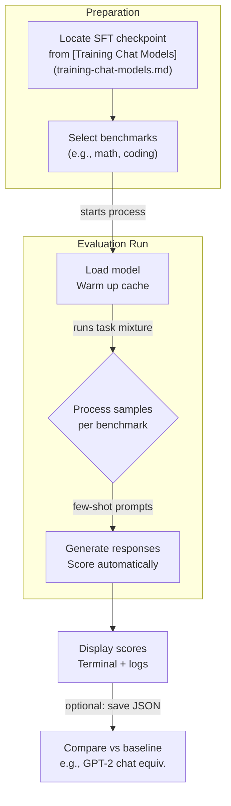

This section covers evaluating chat-tuned models on instruction-following benchmarks such as math problems, coding tasks, and science question answering, using task mixtures or sequential prompting formats. It's designed for users who have completed supervised finetuning (SFT) in [Training Chat Models](training-chat-models.md) and want objective metrics on chat capabilities, beyond base model evaluations in 6.1. Base Model Evaluation. Results help compare against leaderboards or prior runs, and inform iterations before testing in [Chatting with Models](chatting-with-models.md). For full leaderboard submission, see 10. Leaderboard and Optimization.

## Overview
Chat model evaluation runs your finetuned model through standardized benchmarks to measure performance in real-world chat scenarios. It supports task mixtures (batched prompts across multiple benchmarks) or sequences (chained interactions per task), producing centered accuracy scores adjusted for baselines. You'll see progress updates in the terminal, final aggregated scores, and optional logging to external tools. This fits after SFT, providing quick feedback on improvements from data mixtures like MMLU and GSM8K.

## Supported Benchmarks
Evaluations cover key chat domains with few-shot or zero-shot prompting.

| Benchmark | Category | Description | Prompt Style | Typical Output |
|-----------|----------|-------------|--------------|---------------|
| **GSM8K** | Math | Grade-school math word problems requiring step-by-step reasoning. | Few-shot chain-of-thought | *Pass@1 accuracy* (e.g., *87.2%*) |
| **HumanEval** | Coding | Generate functional Python code from docstring descriptions. | Zero-shot | *Pass@1 accuracy* (e.g., *65.4%*) |
| **MMLU** (subset) | Science QA | Multiple-choice questions across STEM subjects like biology, physics. | Few-shot | *Accuracy* (e.g., *52.1%*) |
| **GPQA** (diamond) | Science QA | Graduate-level questions in biology, chemistry, physics. | Zero-shot | *Accuracy* (e.g., *28.9%*) |

> [!NOTE]  
> Benchmarks use centered accuracy: *(model accuracy - random baseline) / (1 - random baseline)*. Aggregated scores average across tasks for a single composite metric.

## Running an Evaluation
1. Ensure your chat model checkpoint is saved from SFT (e.g., in the **model-tag** directory).
2. Launch the evaluation from the command line, specifying your checkpoint and options.
3. Monitor terminal output for per-task progress (e.g., "Evaluating GSM8K: 50/100 samples complete").
4. Review final scores printed at the end, such as "Composite Chat Score: *0.623*".

## Configuration Options
Customize runs via settings passed at launch.

| Setting | Default | Options | What It Controls |
|---------|---------|---------|------------------|
| **max-samples-per-task** | *100* | Positive integer (e.g., *50*, *200*) | Limits samples evaluated per benchmark to control runtime. |
| **task-mixture** | *balanced* | *balanced*, *math-heavy*, *coding-heavy*, *sequence* | Mix of benchmarks (*balanced* averages all; *sequence* chains multi-turn). |
| **few-shot-k** | *5* | Integer *0-32* | Number of examples in prompts (higher improves reasoning tasks). |
| **output-format** | *terminal* | *terminal*, *json*, *wandb* | Where scores appear (*wandb* logs to Weights & Biases for tracking). |
| **device-batch-size** | *auto* | Power of 2 (e.g., *8*, *16*) | Samples processed simultaneously (lower if memory errors occur). |
| **model-path** | *latest-sft* | Full path to checkpoint | Loads specific finetuned model (required). |

> [!WARNING]  
> High **few-shot-k** or **max-samples-per-task** increases runtime and memory use. Start small for testing.

## Viewing Results
- **Terminal output**: Per-task accuracies (e.g., "GSM8K: *89.5%* (centered: *0.912*)"), composite score, and total time.
- **JSON export**: Detailed per-sample predictions and ground truths for manual review.
- **Comparisons**: Scores auto-compare to baselines like GPT-2 equivalents (e.g., "Beats GPT-2 chat by +12% on math").

Example composite: *Chat Score: 0.623* (average centered accuracy across 4 tasks).

## Troubleshooting

| Message | Severity | Meaning |
|---------|----------|---------|
| "Model checkpoint not found at **model-path**" | Error | Check path from SFT run; reload latest from **model-tag**. |
| "Out of memory on **device-batch-size**=16" | Error | Reduce to *8* or *4*; clear GPU cache or use CPU fallback. |
| "Benchmark data unavailable (e.g., GSM8K)" | Warning | Download missing datasets automatically or check internet. |
| "Low score variance across runs (>5%)" | Info | Normal for small samples; increase **max-samples-per-task** for stability. |

> [!NOTE]  
> Noisy scores? Run multiple times and average. For leaderboard, use full samples (*max-samples-per-task=-1*).

## Summary
- Evaluate chat models on math (**GSM8K**), coding (**HumanEval**), and science QA (**MMLU**, **GPQA**) via task mixtures or sequences for composite scores.
- Configure with **max-samples-per-task**, **task-mixture**, and **few-shot-k** for flexible testing.
- View centered accuracies in terminal/JSON/W&B; compare to baselines for progress.
- Integrates post-[Training Chat Models](training-chat-models.md); precedes [Chatting with Models](chatting-with-models.md) and 10. Leaderboard and Optimization.
- For base evals, see 6.1. Base Model Evaluation; track optimizations in 9. Configuration Reference.