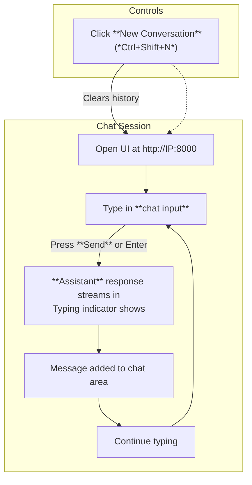
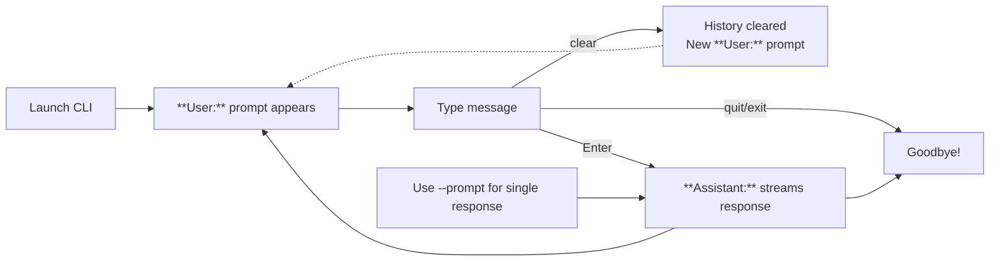

This section covers interactive chatting with your trained models using either a web-based user interface or a command-line interface (CLI). It's designed for end users who have completed model training or evaluation and want to test conversational capabilities in real time. Chatting leverages efficient generation with key-value caching for faster responses. For preparing models to chat, see [Training Chat Models](training-chat-models.md) and [Model Evaluation](model-evaluation.md). For hardware setup that affects performance here, see [Getting Started](getting-started.md) and [Configuration Reference](configuration-reference.md).

## Overview
The chatting features provide two ways to interact with models: a **Web Chat UI** resembling familiar chat applications (like ChatGPT) for browser-based use, and a **CLI Chat** for terminal-based sessions. Both support multi-turn conversations, streaming responses (text appears as generated), and sampling controls like *temperature* and *top-k* for varied outputs. Conversations use special tokens to structure user/assistant exchanges. Start a new session anytime, and clear history as needed.

## Web Chat UI
Access the **Web Chat UI** by launching the web server and opening the provided URL in your browser (e.g., *http://0.0.0.0:8000* or a public IP for remote access). The interface features a clean, responsive design with a header, scrollable chat area, and bottom input bar.

### Interface Elements
- **Header**: Contains the **nanochat** title and **New Conversation** button (plus icon; shortcut: *Ctrl+Shift+N*). Clicking it clears the current chat and starts fresh.
- **Chat Area**: Displays messages in sequence. **User** messages appear on the right in light gray bubbles. **Assistant** responses stream in real-time on the left (plain text style, hover for subtle highlight).
- **Input Area**: 
  - **Chat input** textarea (placeholder: *Ask anything*). Supports multi-line text; expands up to 200px height. Focus highlights border in blue.
  - **Send** button (arrow icon). Enabled when input has text; disabled otherwise. Hover darkens; click or *Enter* (with *Shift+Enter* for new line) sends.
- A typing indicator (*···*) shows during generation.

### Starting and Managing Conversations
1. Launch the server (see ## Launch Options below).
2. Open the printed URL (e.g., *http://YOUR-IP:8000*).
3. Type in the **chat input** and press **Send** or *Enter*.
4. Watch the **Assistant** response stream in.
5. Repeat for multi-turn chat; history is maintained until **New Conversation**.
6. Use **New Conversation** to reset.

> [!NOTE]  
> Conversations are session-based in the browser. Refreshing reloads a blank chat.

### Limits and Validation
The UI enforces safeguards to prevent overload:

| Limit | Value | Effect |
|-------|-------|--------|
| Messages per request | *500 max* | Exceeding shows error: "Too many messages. Maximum 500 messages allowed per request" |
| Characters per message | *8000 max* | Exceeding shows error for that message: "Message X is too long. Maximum 8000 characters allowed per message" |
| Total conversation length | *32000 characters max* | Exceeding shows error: "Total conversation is too long. Maximum 32000 characters allowed" |
| Roles | *user*, *assistant*, *system* only | Invalid role shows error: "Message X has invalid role. Must be 'user', 'assistant', or 'system'" |
| Temperature | *0.0–2.0* | Out-of-range clamped or rejected |
| Top-k | *0–200* (*0* = full vocab) | Out-of-range clamped or rejected |
| Max tokens | *1–4096* | Out-of-range clamped or rejected |

Errors appear as red banners below the input.

## CLI Chat
Run the CLI for terminal-based chatting. It supports interactive multi-turn sessions or single-prompt responses.

### Interface and Commands
- Prompts as **User:** (your input).
- Responses stream as **Assistant:** (text appears token-by-token).
- Special commands:
  | Command | Effect |
  |---------|--------|
  | *quit* or *exit* | Ends session |
  | *clear* | Resets conversation history |
  | Empty input | Skips turn |

### Starting Sessions
1. Launch with defaults for interactive mode (see ## Launch Options).
2. Type at **User:** prompt.
3. Response streams at **Assistant:**.
4. Continue or use commands.

For one-shot: Provide *--prompt* value; gets single response and exits.

## Launch Options
Both tools load models from *sft* or *rl* sources (see [Training Chat Models](training-chat-models.md)). Use tags/steps from checkpoints.

### Web Server Options
| Setting | Default | Options | What It Controls |
|---------|---------|---------|------------------|
| **--num-gpus** or **-n** | *1* | Integer (*1+*) | GPUs for parallel workers (CUDA only; prints init status) |
| **--source** or **-i** | *sft* | *sft*, *rl* | Model source directory |
| **--model-tag** or **-g** | None | String | Specific model tag to load |
| **--step** or **-s** | None | Integer | Checkpoint step to load |
| **--temperature** or **-t** | *0.8* | Float (*0.0–2.0*) | Default generation randomness |
| **--top-k** or **-k** | *50* | Integer (*0–200*) | Default token sampling limit |
| **--max-tokens** or **-m** | *512* | Integer (*1–4096*) | Default response length |
| **--port** or **-p** | *8000* | Integer | Server port (prints access URL) |
| **--dtype** or **-d** | *bfloat16* | *float32*, *bfloat16* | Precision (affects speed/memory) |
| **--device-type** | Autodetect | *cuda*, *cpu*, *mps* | Hardware target |
| **--host** | *0.0.0.0* | IP string | Bind address (use public IP for remote) |

Console shows: worker init, access URL, health/stats endpoints (*GET /health*, *GET /stats*).

### CLI Options
| Setting | Default | Options | What It Controls |
|---------|---------|---------|------------------|
| **--source** or **-i** | *sft* | *sft*, *rl* | Model source directory |
| **--model-tag** or **-g** | None | String | Specific model tag to load |
| **--step** or **-s** | None | Integer | Checkpoint step to load |
| **--prompt** or **-p** | '' | String | Single input for one-shot response (exits after) |
| **--temperature** or **-t** | *0.6* | Float | Generation randomness |
| **--top-k** or **-k** | *50* | Integer | Token sampling limit |
| **--device-type** | Autodetect | *cuda*, *cpu*, *mps* | Hardware target |
| **--dtype** or **-d** | *bfloat16* | *float32*, *bfloat16* | Precision |

## Troubleshooting
Common issues appear in browser errors, console output, or terminal.

| Message | Severity | Meaning |
|---------|----------|---------|
| "Too many messages. Maximum *500* messages allowed per request" | Error | Web request exceeded message limit; shorten history or start new conversation |
| "Message X is too long. Maximum *8000* characters allowed per message" | Error | Specific message too long; edit and resend |
| "Total conversation is too long. Maximum *32000* characters allowed" | Error | Full history too long; use **New Conversation** |
| "At least one message is required" or "Message X has empty content" | Error | Empty submission; add text to **chat input** |
| "Initializing worker pool with X GPUs..." followed by per-GPU loads | Info | Normal startup; wait for "All workers initialized!" |
| No response or slow generation | Warning | Check hardware ([Configuration Reference](configuration-reference.md)); try *cpu* if GPU issues; reduce *max-tokens* |
| "Goodbye!" | Info | Normal CLI exit via *quit*/*exit* or *--prompt* |

> [!WARNING]  
> Long contexts may slow down or hit limits; clear often. Multiple GPUs require CUDA.

## Summary
- Use **Web Chat UI** for browser-friendly, streaming multi-turn chats with new conversation controls and built-in limits.
- Use **CLI Chat** for terminal sessions with *clear*, *quit*, or single *--prompt* responses.
- Customize generation via launch options like **--temperature**, **--top-k**, and model selection (**--source**, **--model-tag**).
- Access web via printed URL; monitor server console for status.
- For model prep, see [Training Chat Models](training-chat-models.md) and [Model Evaluation](model-evaluation.md). Tune hardware in [Configuration Reference](configuration-reference.md). Explore advanced use in [Advanced Workflows](advanced-workflows.md).