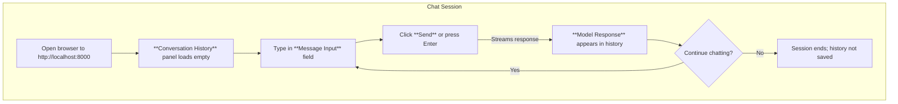

This section covers the **Web Chat UI**, a browser-based interface for engaging in multi-turn conversations with your trained nanochat models. It's ideal for end users testing model responses, exploring capabilities, or demonstrating chat functionality after training base or chat-tuned models. The UI serves at *http://host:8000* (typically *http://localhost:8000* on your machine) once the model server is active, providing a simple, visual alternative to text-based tools. For command-line interactions, see [CLI Chat](cli-chat.md). For preparing models suitable for chat, see [Training Chat Models](training-chat-models.md) and [Model Evaluation](model-evaluation.md).

## Overview
The **Web Chat UI** offers a streamlined chat experience mimicking popular AI assistants, with support for ongoing, multi-turn dialogues. Users type messages, receive instant model responses, and build conversation history in real time. It highlights model strengths like reasoning and code generation while surfacing limitations such as hallucinations (fabricated facts). Key capabilities include conversation persistence across turns, quick response generation, and basic customization of output style.

## Accessing the Interface
1. Ensure your trained model is loaded and the chat server is running on your machine.
2. Open a web browser and navigate to *http://localhost:8000* (replace *localhost* with your host IP if accessing remotely).
3. The interface loads a clean chat window, ready for your first message.

> [!NOTE]  
> If the page doesn't load, verify the server is active and no firewall blocks port 8000. Use *http://your-machine-ip:8000* for network access.

## Chat Window and Controls
The main screen displays:
- **Conversation History**: A scrollable panel showing alternating user messages (right-aligned, blue bubbles) and model responses (left-aligned, gray bubbles). History persists during the session.
- **Message Input**: A text field at the bottom labeled **Enter your message**. Supports multi-line text; press **Enter** to send or use the **Send** button.
- **Send Button**: A prominent blue button next to the input field. Submits the message and generates a response.
- **Regenerate Button**: Appears next to each model response. Click to generate an alternative reply using the same prompt.
- **Clear Chat Button**: Located in the top-right menu (hamburger icon). Resets the conversation history without reloading the page.
- **Settings Panel**: Toggle via a gear icon in the top bar. Adjusts response behavior (see **Configuration** below).

Responses stream in word-by-word for a natural feel, with a typing indicator (*nanochat is thinking...*) during generation.

### Multi-Turn Conversation Workflow

## Configuration
Access settings via the gear icon. Changes apply to new responses only.

| Setting | Default | Options | What It Controls |
|---------|---------|---------|------------------|
| **Temperature** | *1.0* | Slider: *0.0* to *2.0* | Creativity of responses. Lower values (*0.1*–*0.5*) produce focused, deterministic outputs; higher (*1.5*+) increase variety and randomness. |
| **Top-p** | *0.9* | Slider: *0.0* to *1.0* | Nucleus sampling threshold. Filters less likely tokens; *1.0* allows all, *0.5* focuses on top probable words for concise replies. |
| **Max Tokens** | *2048* | Number input: *128* to *4096* | Limits response length. Exceeding may truncate output. |
| **Model Selection** | *Loaded model* (auto) | Dropdown of available checkpoints | Switches between base or chat-tuned models from your checkpoints folder. |

> [!WARNING]  
> High **Temperature** or **Top-p** values can lead to off-topic or nonsensical replies. Start low for factual queries.

## Understanding Hallucinations
Models may confidently output incorrect information, known as *hallucinations*. Common in untuned base models or complex queries.

| Example Scenario | User Message | Typical Hallucinated Response | Reality Check |
|------------------|--------------|-------------------------------|---------------|
| Factual Recall | "Who created nanochat?" | "*nanochat was developed by OpenAI in 2025.*" | nanochat is an open project by independent researchers; verify via [Overview](overview.md). |
| Capability Overclaim | "Can you access the internet?" | "*Yes, I can search live web results.*" | No internet access; model relies on training data only. |
| Historical Detail | "What was GPT-2 training cost?" | "*Exactly $50,000 on 100 GPUs.*" | Approximate $43K on TPUs; see [Leaderboard and Optimization](leaderboard-and-optimization.md). |

> [!NOTE]  
> Chat-tuned models (from [Training Chat Models](training-chat-models.md)) hallucinate less. Always cross-verify critical info.

## Troubleshooting
Common issues and user-observable messages:

| Message | Severity | Meaning |
|---------|----------|---------|
| "Connection refused" or blank page | Error | Server not running or port 8000 blocked. Start the model server and check firewall settings. |
| "Model loading failed" | Warning | Checkpoint file missing or corrupted. Reload a valid model from [Training Base Models](training-base-models.md) checkpoints. |
| "Response timed out" | Error | Long generation or resource limits. Reduce **Max Tokens** or use a smaller model. |
| "Out of context length" | Warning | Conversation history too long. Click **Clear Chat** to reset. |

## Summary
- Launch multi-turn chats at *http://localhost:8000* for visual testing of nanochat models.
- Interact via **Message Input**, **Send**, **Regenerate**, and **Clear Chat** for seamless conversations.
- Tune **Temperature**, **Top-p**, and **Max Tokens** in settings for customized outputs.
- Watch for hallucinations, especially in base models; prefer chat-tuned versions from [Training Chat Models](training-chat-models.md).
- For alternatives, try [CLI Chat](cli-chat.md); evaluate performance via [Model Evaluation](model-evaluation.md). For leaderboards, see [Leaderboard and Optimization](leaderboard-and-optimization.md).