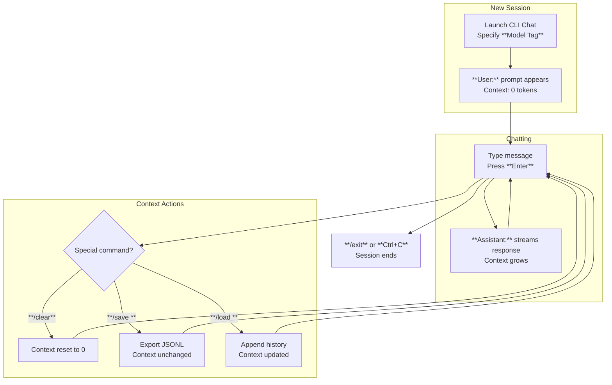

This section covers the **CLI Chat**, a lightweight, terminal-based interface for conversing with your trained nanochat models. It's designed for end users who prefer command-line workflows, quick model testing, headless servers, or integration into scripts. The CLI Chat maintains full conversation context across multiple turns, enabling natural multi-turn dialogues. It complements the browser-based [Web Chat UI](web-chat-ui.md) for graphical interactions. To chat with models, first train or download them via [Training Base Models](training-base-models.md), [Training Chat Models](training-chat-models.md), or the [Leaderboard and Optimization](leaderboard-and-optimization.md). For hardware tweaks during chatting, see [Hardware and Precision Options](hardware-and-precision-options.md).

## Overview

The **CLI Chat** provides a simple, interactive text interface in your terminal for testing model responses. Key capabilities include:
- Real-time message exchange: Type user messages and receive instant model replies.
- Automatic context tracking: Conversation history is preserved up to the model's maximum context length, influencing future responses.
- Inline controls: Special commands to adjust settings, manage history, or export sessions without exiting.
- Streaming responses: Model outputs appear word-by-word for a responsive feel.

It's optimized for single-user sessions on CPU or GPU, with low overhead for rapid iteration during model evaluation (see [Model Evaluation](model-evaluation.md)).

## Launching and Interface

To begin, open your terminal in the project directory and start the CLI Chat by specifying your trained model. The interface launches immediately, displaying a welcome banner with the model details (e.g., size, training run name) and current settings.

You'll see:
- **User:** prompt (blinking cursor) for your input.
- **Assistant:** prefixed responses from the model.
- A status line at the top showing active context length, temperature, and device usage.

Example interaction flow:
1. Type your message at the **User:** prompt (e.g., "Hello, what can you do?").
2. Press **Enter** to send.
3. Watch the **Assistant:** response stream in real-time.
4. The prompt returns to **User:** for the next turn.

To exit, type `/exit` or press **Ctrl+C**.

> [!NOTE]  
> Conversations are ephemeral by default but can be saved/loaded for reuse.

## Special Commands

During a chat, prefix commands with `/` at the **User:** prompt and press **Enter**. No model response is generated for commands.

| Command | Example | Description |
|---------|---------|-------------|
| **/help** | `/help` | Lists all available commands and current settings. |
| **/clear** | `/clear` | Resets conversation context to empty (starts fresh). |
| **/save** | `/save my_chat.jsonl` | Exports full conversation history to a JSONL file (*filename* required). Each line is a turn with user/assistant messages. |
| **/load** | `/load my_chat.jsonl` | Loads conversation history from a JSONL file (*filename* required), appending to current context. |
| **/temp** | `/temp 1.2` | Sets sampling *temperature* (*0.0* to *2.0*; default *0.8*). Higher values increase creativity/randomness. |
| **/topk** | `/topk 50` | Sets top-K sampling (*1* to *100*; default *50*). Limits token choices to top *K* probable ones. |
| **/topp** | `/topp 0.9` | Sets top-P (nucleus) sampling (*0.0* to *1.0*; default *0.9*). Samples from smallest set summing to probability *P*. |
| **/len** | `/len 1024` | Sets maximum response length in tokens (*64* to model's context limit; default *512*). |
| **/status** | `/status` | Shows current context token count, settings, and device memory usage. |

Changes apply immediately to the next response.

## Configuration Options

Launch the CLI Chat with optional flags to set defaults. These override in-chat commands and persist for the session.

| Setting | Default | Options | What It Controls |
|---------|---------|---------|------------------|
| **Model Tag** | *none* | Name of a trained model (e.g., *d26_feb2_fp8_ratio8.25*) | Loads the specified checkpoint for chatting. Required for first use. |
| **Model Path** | *none* | Full path to checkpoint directory | Alternative to **Model Tag** for custom/local models. |
| **Device** | *auto* | *cpu*, *cuda* | Runs inference on CPU (slower) or GPU (faster). Detects available GPU if *auto*. |
| **Temperature** | *0.8* | *0.0* to *2.0* | Initial randomness for response generation. |
| **Max Context** | *model max* (e.g., 2048 tokens) | *512* to *model max* | Limits total conversation history to prevent overflow. Older messages are trimmed. |
| **Batch Size** | *1* | *1* to *8* | Number of parallel inferences (GPU only; increases throughput for repeated prompts). |
| **Precision** | *auto* | *bf16*, *fp8*, *fp32* | Inference data type (*fp8* fastest on supported GPUs). |

> [!WARNING]  
> Exceeding device memory (e.g., large model on small GPU) causes automatic fallback to CPU. Monitor with `/status`.

## Managing Context

Context is the full history of user/assistant turns, tokenized and fed to the model each response. It grows with each exchange until hitting **Max Context**.

- **Automatic trimming**: When full, oldest turns are dropped to fit new messages.
- **Visual indicator**: Status line shows *used/total* tokens (e.g., "Context: 1450/2048").
- **Save/load workflow**:
  1. Type `/save session.jsonl`.
  2. Resume later: Launch CLI Chat, type `/load session.jsonl`.
  3. Context merges seamlessly.

For long-term sessions, save frequently to avoid data loss on crashes.

## Troubleshooting

Common issues and user-observable messages:

| Message | Severity | Meaning |
|---------|----------|---------|
| "Model tag not found. List available with..." | Warning | Specified **Model Tag** doesn't exist. Check trained models in your checkpoints directory or use **Model Path**. Relaunch with valid tag. |
| "Context overflow: trimming oldest turns." | Info | History exceeded **Max Context**. Response still generates; use `/clear` or increase limit to retain more. |
| "Falling back to CPU: insufficient GPU memory." | Warning | GPU OOM during load/inference. Reduce **Batch Size**, use smaller model, or switch to **Device: cpu**. |
| "Invalid JSONL: corrupted or wrong format." | Error | **/load** failed. Ensure file has valid chat turns (user/assistant pairs). Regenerate with `/save`. |
| "No GPU detected, using CPU (slower responses)." | Info | **Device: auto** but no CUDA GPU. Expected on non-GPU machines; responses take longer (~10x). |

> [!NOTE]  
> Check terminal output for device stats. Slow responses? Verify GPU with `/status` and [Hardware and Precision Options](hardware-and-precision-options.md).

## Summary

- **CLI Chat** offers terminal-based, context-aware conversations for efficient model testing.
- Interact via **User:**/**Assistant:** prompts with `/` commands for controls like `/clear`, `/save`, `/temp`.
- Configure at launch: **Model Tag**, **Temperature**, **Device**, etc., for customized sessions.
- Manage context visually with token counts; export to JSONL for persistence.
- Ideal companion to [Web Chat UI](web-chat-ui.md); evaluate post-training with [Model Evaluation](model-evaluation.md) or submit to [Leaderboard and Optimization](leaderboard-and-optimization.md). For base/chat model prep, see [Training Base Models](training-base-models.md) and [Training Chat Models](training-chat-models.md).