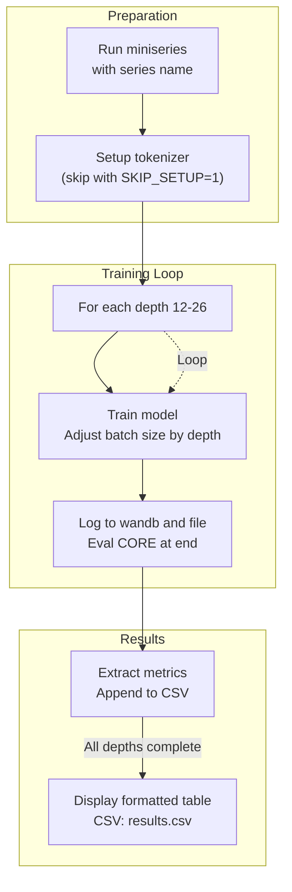

This section covers **Advanced Workflows** for experienced users conducting systematic experiments on model scaling, training series, and generating custom datasets. These workflows build on core training and evaluation processes to explore performance trends, such as how model depth affects capabilities and efficiency. They are ideal for researchers tuning hyperparameters, analyzing scaling laws, or creating specialized training data. For foundational training, see [Training Base Models](training-base-models.md). For evaluation metrics like **CORE score**, see [Model Evaluation](model-evaluation.md). Hardware and precision options are detailed in [Configuration Reference](configuration-reference.md).

## Overview
Advanced Workflows provide automated sequences for running multiple training runs, collecting metrics into summary files, and generating synthetic datasets. Key capabilities include:
- Sweeping model depths in a **miniseries** to benchmark efficiency.
- Fixed compute budget experiments for **scaling laws** analysis.
- Creating diverse conversation datasets for chat model finetuning.

Results are saved as CSV files with columns for depths, parameters, training time, validation bits per byte (**BPB**), and **CORE score**, plus formatted terminal tables for quick review.

## Miniseries Training
Use this workflow to train a series of models with increasing depths (from *12* to *26*) and compare their scaling behavior. It automatically handles setup, training, metric extraction, and CSV logging.

### Running the Workflow
1. Open a terminal in the project directory.
2. Run **miniseries** with an optional *series name* (e.g., *jan11*; defaults to current date in lowercase like *oct15*).
3. The workflow performs initial setup (downloads tokenizer data, trains tokenizer unless skipped), then trains each depth sequentially.
4. Monitor progress via terminal logs and optional Weights & Biases (**wandb**) integration.
5. At completion, view a formatted table of results and a CSV file in the cache directory under *series_name_miniseries_results/results.csv*.

> [!NOTE]  
> Set environment variables before running: **SKIP_SETUP=1** to bypass tokenizer setup, **NPROC_PER_NODE=8** (default) for GPU count per node, **WANDB_RUN=series_name_miniseries** for logging.

### Outputs and Metrics
Training adjusts **device batch size** automatically (*32* for depths <20, *16* for 20-27, *8* for ≥28) to prevent memory issues. Each run logs to a per-depth file and appends to the CSV.

| Field              | Description |
|--------------------|-------------|
| **depth**         | Model depth (*12* to *26*). |
| **model_dim**     | Embedding dimension (*depth × 64*). |
| **num_params**    | Total model parameters. |
| **num_scaling_params** | Parameters in scaling components (transformer matrices, etc.). |
| **num_iterations**| Training steps completed. |
| **tokens_trained**| Total tokens seen (*iterations × 524288*). |
| **param_data_ratio** | Tokens per scaling parameter (higher is more data-efficient). |
| **val_bpb**       | Final validation bits per byte (lower is better). |
| **core_score**    | Final **CORE metric** score (higher is better). |
| **train_time_sec**| Wall-clock time in seconds. |

Example results table (from a sample run):

| depth | model_dim | num_params | core_score | train_time_sec |
|-------|-----------|------------|------------|----------------|
| 12    | 768       | 124M       | 0.45       | 180            |
| 20    | 1280      | 345M       | 0.62       | 450            |
| 26    | 1664      | 582M       | 0.71       | 720            |

## Scaling Laws Experiments
This workflow trains models across depths (*8* to *20*) at fixed compute budgets (FLOPs like *1e18* to *1e19*) to study optimal allocation. It skips completed runs and provides detailed parameter breakdowns.

### Running the Workflow
1. Open a terminal in the project directory.
2. Run **scaling_laws** (uses label like *jan26* by default; set **LABEL** env var).
3. It trains only missing combinations, using *~100M tokens* for final evaluation.
4. Results append to *scaling_laws_results_label/results.csv* with a terminal table.

> [!NOTE]  
> Customize via **NPROC_PER_NODE**, **WANDB_RUN**, **EVAL_TOKENS**.

### Outputs and Metrics
CSV includes granular parameter counts for analysis.

| Field                  | Description |
|------------------------|-------------|
| **flops_budget**      | Target FLOPs (e.g., *1e18*). |
| **depth**             | Model depth. |
| **params_transformer**| Transformer matrix parameters. |
| **params_total**      | All parameters. |
| **val_bpb**           | Final validation **BPB**. |
| **core_score**        | Final **CORE** score. |

## Synthetic Data Generation
Generate diverse multi-turn conversations between users and the model for use in supervised finetuning (**SFT**). Outputs JSONL files compatible with [Training Chat Models](training-chat-models.md).

### Running the Workflow
1. Set **OPENROUTER_API_KEY** environment variable.
2. Run **gen_synthetic_data** in the terminal.
3. It produces a JSONL file with conversations varying by topic (*identity*, *architecture*, etc.), user *persona* (e.g., *curious beginner*), *dynamics* (e.g., *skeptical arc*), and opening messages.

Each conversation is a structured JSON object with balanced diversity for high-quality SFT data.

## Configuration Options
Common to all workflows:

| Setting              | Default       | Options                          | What It Controls |
|----------------------|---------------|----------------------------------|------------------|
| **NPROC_PER_NODE**  | *8*          | Positive integer                | GPUs per node. |
| **SKIP_SETUP**      | Unset (*0*)  | *1* to skip                     | Tokenizer/dataset prep. |
| **WANDB_RUN**       | Auto-generated | Custom string                   | Logging project name. |
| **SERIES_NAME**/**LABEL** | Date/label | Custom string               | Results folder prefix. |

## Troubleshooting

| Message | Severity | Meaning |
|---------|----------|---------|
| "Skipping d=*X* at *Y* FLOPs (already in results)" | Info | Run exists in CSV; no action needed. |
| "WARNING: Could not extract CORE score for d=*X*" | Warning | Log missing final eval; check hardware/logs and rerun. |
| "Training d=*X*: params=..., CORE=*Z*" | Info | Summary of completed run; use for quick checks. |

> [!WARNING]  
> Large depths may cause out-of-memory; lower **device batch size** manually if needed.

## Summary
- **Miniseries** automates depth sweeps (*12-26*), outputs CSV with **CORE**, **BPB**, time for efficiency plots; see results table.
- **Scaling Laws** tests fixed FLOPs budgets across depths, skips duplicates, detailed params for analysis.
- **Synthetic Data** creates diverse JSONL conversations via API for **SFT**; requires API key.
- Integrates with [Training Base Models](training-base-models.md), [Model Evaluation](model-evaluation.md); customize hardware in [Configuration Reference](configuration-reference.md). For chatting results, use [Chatting with Models](chatting-with-models.md).