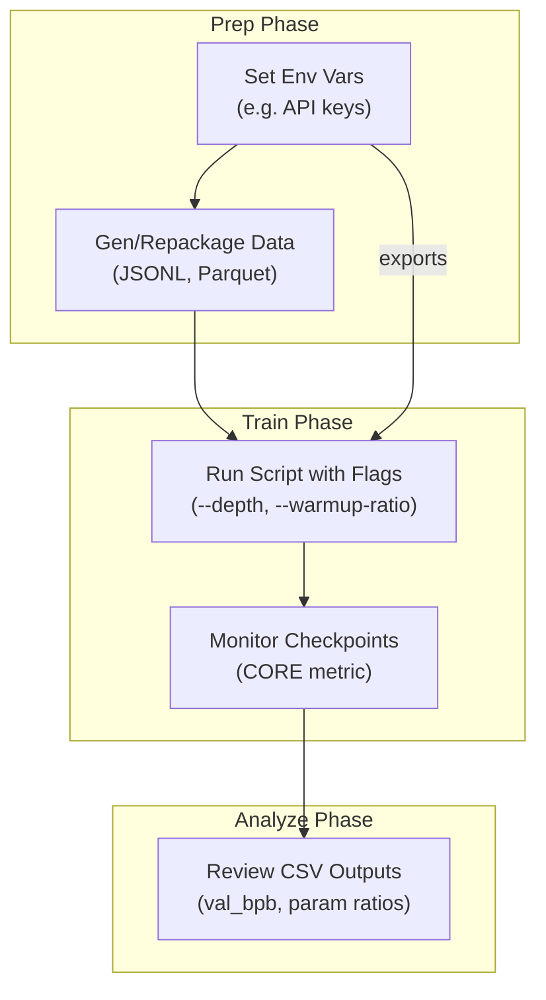

This section covers the **Configuration Reference**, a complete guide to all command-line flags, environment variables, and supported data formats used in nanochat scripts for training, evaluation, synthetic data generation, and data preparation. It's designed for advanced users customizing workflows beyond defaults, such as tuning training schedules, optimizer states, or dataset handling. Flags and variables integrate across tools like base model training, supervised finetuning (SFT), and evaluation—see [Training Base Models](training-base-models.md) for training usage, [Training Chat Models](training-chat-models.md) for SFT specifics, [Model Evaluation](model-evaluation.md) for eval configs, and [Advanced Workflows](advanced-workflows.md) for data prep examples.

## Overview
The configuration system uses command-line flags (prefixed with `--`) for script-specific overrides and environment variables for global or sensitive settings like API keys. Flags control aspects like learning rate schedules, data epochs, optimizer loading, and dataset sharding. Data formats ensure compatibility with dataloaders, supporting streaming from compressed files. Defaults are tuned for reproducibility (e.g., matching GPT-2 capabilities), but you can adjust for hardware, scale, or experiments. Use `--help` on any script for a full list.

## Environment Variables
Set these in your shell (e.g., `export KEY=value`) or `.env` file before running scripts. They handle API access, caching, and uploads.

| Setting              | Default              | Description |
|----------------------|----------------------|-------------|
| **OPENROUTER_API_KEY** | *none*              | Required for `gen_synthetic_data.py` to generate diverse multi-turn conversations via OpenRouter API. Provides entropy via topics, personas, and dynamics for high-quality SFT data. |
| **HF_TOKEN**         | *none*              | Optional for dataset upload scripts (e.g., after repackaging FineWeb-Edu). Authenticates pushes to Hugging Face repos like `karpathy/fineweb-edu-100b-shuffle`. |
| **NANOCHAT_BASE_DIR**| `~/.cache/nanochat` | Root for datasets, checkpoints, scaling results (e.g., `scaling_laws_results_jan26/results.csv`), and outputs. Override for custom storage. |

> [!NOTE]  
> Load `.env` files automatically in data generation scripts. Test API keys separately to avoid runtime failures.

## Command-Line Flags
Flags are grouped by workflow. Pass them directly to scripts like `base_train.py`, `chat_sft.py`, or data tools (e.g., `python dev/repackage_data_reference.py --custom-arg` where supported).

### Global Flags
Common across training and eval for hardware, batching, and monitoring.

| Flag                  | Default | Accepted Values          | What It Controls |
|-----------------------|---------|--------------------------|------------------|
| **--depth**           | *varies by script* | Positive integer (e.g., *18*, *26*) | Model depth (layers), scaling compute and parameters. Higher values increase capacity but raise memory needs. Ties to CORE metric tracking. |
| **--device-batch-size**| *auto* | Positive integer        | Per-device batch size for training/eval. Balances throughput and memory; tune for single GPU/CPU runs (see [Running on CPU or Single GPU](running-on-cpu-or-single-gpu.md)). |
| **--warmup-ratio**    | *script-specific* | Float [0.0, 1.0]       | Fraction of steps for LR warmup. Matches pretraining schedules for stable starts. |
| **--warmdown-ratio**  | *0.5*  | Float [0.0, 1.0]        | Fraction of steps for LR warmdown (linear decay to final LR). Improves convergence in SFT. |
| **--init-lr-frac**    | *0.8*  | Float [0.0, 1.0]        | Initial LR as fraction of peak. Lower values stabilize SFT after base model loading. |
| **--final-lr-frac**   | *script-specific* | Float [0.0, 1.0]        | Final LR as fraction of peak during warmdown. |

### Training and SFT Flags
Specific to `base_train.py` and `chat_sft.py`. Load pretrained states for chat finetuning.

| Flag                  | Default | Accepted Values | What It Controls |
|-----------------------|---------|-----------------|------------------|
| **--load-optimizer**  | *1* (on) | *0* or *1*     | Loads pretrained momentum buffers from checkpoints. Resets LRs for SFT; slightly better stability. Requires matching optimizer (e.g., Muon). |
| **--mmlu-epochs**     | *3*    | Positive integer | Epochs over MMLU data in SFT mixtures. Higher values emphasize instruction-following. |
| **--gsm8k-epochs**    | *4*    | Positive integer | Epochs over GSM8K data in SFT. Boosts math/reasoning; tuned from sweeps. |

> [!WARNING]  
> Changing epoch counts alters data mixtures—monitor validation loss to avoid overfitting.

### Data Preparation Flags
For scripts like `repackage_data_reference.py` (reference only; adapts to HF datasets).

| Flag                  | Default | Accepted Values     | What It Controls |
|-----------------------|---------|---------------------|------------------|
| **--chars-per-shard** | *250M* | Positive integer   | Target characters per output shard (~100MB compressed). Enables streaming dataloaders. |
| **--row-group-size**  | *1024* | Positive integer (multiple of 2 preferred) | Parquet row groups for efficient distributed loading. |

## Data Formats
Scripts expect standardized inputs for seamless dataloading. Outputs match for checkpoints and evals.

| Format       | Used In                  | Structure/Details | Example Usage |
|--------------|--------------------------|-------------------|---------------|
| **JSONL**    | SFT (`CustomJSON` task), synthetic data gen | One JSON object per line: `{"messages": [{"role": "user", "content": "..."}, {"role": "assistant", "content": "..."}]}` for multi-turn convos. Generated with topic/persona diversity. | `gen_synthetic_data.py` → SFT input. |
| **Parquet**  | Pretraining (FineWeb-Edu shards) | Single **text** column; zstd-compressed (level 3), ~100MB/shard, row group 1024. Shuffled (seed 42). | HF `HuggingFaceFW/fineweb-edu` (*sample-100BT*) → shards in `NANOCHAT_BASE_DIR/base_data`. |
| **CSV**      | Scaling analysis outputs | Columns: `flops_budget`, `val_bpb`, `depth`, `params_*`, `tokens_trained`, `param_data_ratio`. For isoFLOP plotting. | `scaling_laws_results_*/results.csv`. |

> [!NOTE]  
> Parquets support disk caching/streaming, reducing training latency. JSONL ensures valid schemas for SFT.

## Step-by-Step: Applying Configurations
1. Set env vars: `export OPENROUTER_API_KEY=sk-...`.
2. Run data gen: `python dev/gen_synthetic_data.py --output my_sft.jsonl`.
3. Prep data: Adapt `repackage_data_reference.py` for custom shards (e.g., `--chars-per-shard 500000000`).
4. Train with flags: `python chat_sft.py --load-optimizer 1 --warmup-ratio 0.1 --mmlu-epochs 5 data/my_sft.jsonl`.
5. Analyze: Load CSV in notebooks for param-data ratios, filtering incomplete runs (e.g., NaN `val_bpb`).

## Troubleshooting
Common issues from logs and evals. Check terminal or browser console.

| Message | Severity | Meaning |
|---------|----------|---------|
| *Knowledge base file not found* | Error | Missing `self_knowledge.md` for synthetic data. Copy from README or generate via LLM; place in `knowledge/`. |
| *Incomplete run (NaN val_bpb)* | Warning | Training cut short. Increase `--warmup-ratio` or check hardware; filter in analysis CSVs. |
| *API key invalid* | Error | OPENROUTER_API_KEY failed. Verify at openrouter.ai; retry with fresh token. |
| *Shard too small/large* | Info | `--chars-per-shard` unbalanced. Adjust to ~250M chars for 100MB zstd files. |

## Summary
- Use **environment variables** for APIs/caching and **flags** for fine-grained control like LR schedules (`--warmup-ratio`) and data epochs (`--mmlu-epochs`).
- **Data formats** (JSONL, Parquet) enable efficient streaming; prep with sharding for large datasets.
- Tune for scale via **--depth** and analyze param-data ratios in CSVs.
- See 3.1. Configuring Model Size and Training Horizon for depth tuning, 6. Model Evaluation for CORE baselines, 8. Advanced Workflows for custom data, and 9.1. Hardware and Precision Options for device tweaks.